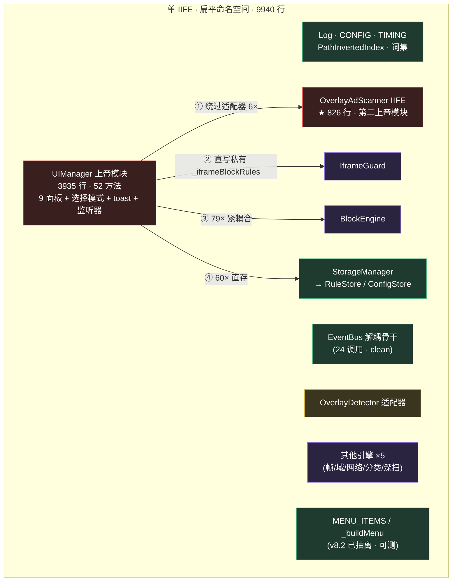
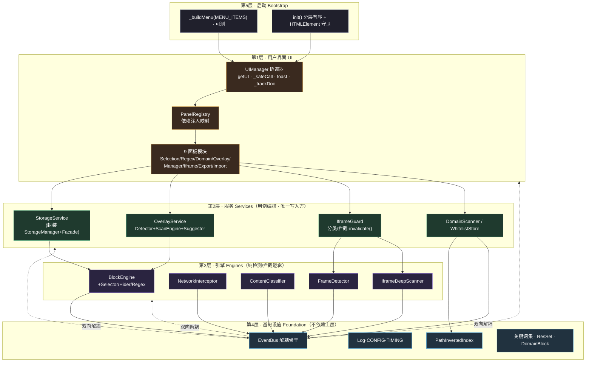

# web-element-blocker.user.js · 架构重设计报告

> 依据 `brooks-harness` 纪律（每步 `node --check` + `npx jest` 门禁）与 `diagram-builder` 绘图规范产出。
> 配套图：本文 Mermaid 版「修改前 / 修改后」架构图 + 对话内联 SVG 高清图。
> 基线：v8.2 扫描（健康分 82.0 / B+）。文件现状：单 IIFE · 9940 行 · 扁平命名空间。

---

## 0. 一句话结论

**功能 100% 不变**，仅重组底层实现结构：把「一个 9940 行扁平 IIFE + 一个 3935 行 UIManager 上帝模块 + 一个 826 行 OverlayAdScanner 上帝 IIFE」重构成 **5 层单向依赖架构**（Foundation → Engines → Services → UI → Bootstrap），通过 `PanelRegistry` 依赖注入把 9 个面板拆成独立可测模块，通过 `StorageService` / `OverlayService` 端口消除跨层直写。这是当前 brooks-lint 残余风险（TD-01 上帝模块、R3 分层违规、T5/R6 测试腐化）的**唯一根治路径**。

---

## 1. 修改前架构（BEFORE）

### 修改前核心病灶（来自 v8.0–v8.2 扫描）

| 编号 | 病灶 | 证据 | 严重度 |
|------|------|------|--------|
| TD-01 / R5-1 | **UIManager 上帝模块**：3935 行、52 方法，一个类承担 9 个无关面板 + 选择模式 + toast + 监听器 + 统计 | L4665–8599 | 🔴 Critical |
| R3-1 | **分层违规**：UI 直连引擎私有状态（`IframeGuard._iframeBlockRules`）、绕过适配器（`UIManager→OverlayAdScanner` 6×，不走 `OverlayDetector`） | grep 实测 | 🔴 Critical |
| R3-2 | **第二上帝 IIFE**：`OverlayAdScanner` 826 行闭包，逻辑与外圈强耦合，无法独立测试 | L3839–4664 | 🟡 Warning |
| T5 / R6-1 | **测试腐化 / 覆盖率幻觉**：GM 菜单链路 0% 真实覆盖（v8.2 才用 `_buildMenu` 接缝补到 3 个契约测试） | v8.2 报告 | 🔴 Critical |
| TD-02/04 | **魔法数字 / 重复代码**：已被 v8.2 `TIMING` 常量与 `_trackDoc` 收敛（本次不重复） | v8.2 FIX-8.8/8.9 | 🟢 已闭环 |
| R1（变更传播） | `UIManager` 一处改动牵连全文件 9940 行语法/作用域；新增第 10 个面板必须改上帝模块 | 结构事实 | 🔴 Critical |

---

## 2. 修改后架构（AFTER · 目标）

**依赖铁律**：箭头只向下（上层依赖下层抽象），下层**永不** `import` 上层；跨层通信一律走 `EventBus` 或注入的端口对象。

---

## 3. 为什么要这样改（六大理由 · 附著作引用）

### 3.1 SRP —— 上帝模块违反单一职责
> 引用：Robert C. Martin《整洁代码》(Clean Code) Ch.10 "Classes" / 《敏捷软件开发：原则、模式与实践》SRP

`UIManager` 同时负责「选择模式交互」「正则规则录入」「iframe 防线」「导出导入」「toast/横幅」「监听器生命周期」「统计」——9+ 个**互不相干**的变化原因挤在一个 3935 行类里。任一面板需求变更都要触碰这个巨大类，回归面覆盖全文件。
**改法**：拆成 `SelectionPanel` / `RegexPanel` / `DomainPanel` / `OverlayScanPanel` / `ManagerPanel` / `IframePanel` / `ExportPanel` / `ImportPanel` 8 个独立模块 + 薄协调器 `UIManager`。每个面板**只有一个变化原因**。

### 3.2 DIP —— 依赖倒置，消除跨层直写
> 引用：Robert C. Martin《整洁架构》(Clean Architecture) Ch.5 "Dependency Inversion"

BEFORE 中 UI 直写引擎私有状态（`IframeGuard._iframeBlockRules`，已被 v8.3 用 `invalidateBlockRules()` 收敛）并绕过适配器（`UIManager→OverlayAdScanner` 6×）。高层（UI）依赖了低层（引擎）的**具体实现细节**。
**改法**：引入 `StorageService`、`OverlayService` 端口对象，UI 只依赖端口接口；引擎内部状态对 UI **不可见**。这把 v8.3 的「单点修复」升级为「结构性契约」。

### 3.3 OCP —— 开闭原则，新增面板零改动
> 引用：Bertrand Meyer / 《整洁架构》Ch.8 "OCP"

BEFORE 新增第 10 个面板 = 在 3935 行上帝模块里加方法 + 在 `_buildMenu` 加一行 + 改 `getUI` 分派。
**改法**：`PanelRegistry` 注册表 + `MENU_ITEMS` 数组。新增面板 = 写独立模块 + 注册一行，**不触碰任何现有代码**，天然符合开闭原则。

### 3.4 存储单一职责 —— 唯一写入方
> 引用：Martin Fowler《企业应用架构模式》(PoEAA) "Repository" / 《重构》§12.2 "Encapsulated Field"

v8.2 实测 `UIManager` 内 `storage.` 直调 60 次。虽然 `RuleStore`/`ConfigStore` 已是门面，但「写入时机与缓存失效」仍散落在 UI 与引擎两侧（v8.3 已用 `invalidateBlockRules()` 收口）。
**改法**：`StorageService` 成为**唯一写入方**，封装 `StorageManager` + 门面 + 缓存失效逻辑；UI/引擎经端口读写，缓存一致性内聚到一处。

### 3.5 拆分第二上帝 IIFE —— 邻接与内聚
> 引用：John Ousterhout《A Philosophy of Software Design》Ch.7 "Different Layer, Different Abstraction" / brooks R3 领域模型扭曲

`OverlayAdScanner` 826 行 IIFE 把「检测 / 规则建议 / 渲染交互」揉在一个闭包，是第二个上帝模块，且 `UIManager` 还绕过 `OverlayDetector` 适配器直接调它。
**改法**：折叠为 `OverlayService`，内部分 `OverlayDetector`（门面，保留现有适配器职责）+ `OverlayScanEngine`（纯扫描）+ `OverlayRuleSuggester`（建议生成）。`UIManager` 只认 `OverlayService` 端口。

### 3.6 可测试性 —— 根治测试腐化（T5/R6）
> 引用：Feathers《Working Effectively with Legacy Code》Ch.3 "Seam" / Meszaros《xUnit Test Patterns》"Test Double"

v8.2 已证明：把 `_buildMenu(MENU_ITEMS, register, uiFactory)` 抽成纯函数 + `window.HTMLElement` 守卫，产物即可被 jest `require`，GM 菜单链路从 0% 升到 3 个真实契约测试。
**改法**：每个面板模块经 `PanelRegistry` 注入 `{ storage, guard, overlay, engine, bus, ui }` 依赖，**可独立单测**；配合 `menu-wiring.test.js` 既有的接缝，9 个面板逐个补齐契约测试，彻底关闭「覆盖率幻觉」。

---

## 4. 分层 → 现有模块映射表

| 目标层 | 现有代码落点（行号） | 改造动作 |
|--------|----------------------|----------|
| **L4 基础设施** | `Log`(101) `CONFIG`(165) `TIMING`(3798) `PathInvertedIndex`(1054) 关键词集(238–309) `ResourceSelectorBuilder`(189) `DomainBlockExecutor`(204) `EventBus`(8600) | 基本不动；`EventBus` 提升为全层解耦骨干 |
| **L3 引擎** | `BlockEngine`(2292) `NetworkInterceptor`(3189) `ContentClassifier`(8815) `FrameDetector`(8621) `IframeDeepScanner`(9125) `SelectorBuilder`(1406) `ElementHider`(1377) `RegexEngine`(1531) `CSSInjector`(1139) `DomScanner`(1855) | 纯逻辑保留；`FrameDetector.queryIframes()` 已下沉（v8.1 FIX-8.5） |
| **L2 服务** | `StorageManager`(364)→`storage`(1027)→`RuleStore/ConfigStore`(349/356) `OverlayDetector`(3812)+`OverlayAdScanner`(3839) `IframeGuard`(9306) `DomainAnalyzer`(3198)+`GlobalDomainScanner`(3230) `WhitelistStore`(8758) | 新增 `StorageService` / `OverlayService` 端口；`IframeGuard` 保留（已含 `invalidateBlockRules`） |
| **L1 用户界面** | `UIManager`(4665) 9 个面板方法(5260–8495) `MENU_ITEMS`(9845) `_buildMenu` | `UIManager` 瘦身为协调器；9 方法 → 9 独立面板模块；`PanelRegistry` 注入 |
| **L5 启动** | 初始化块（原 ~9828，现 `MENU_ITEMS` 之后） | `init()` 改为分层有序调用 + `window.HTMLElement` 守卫（v8.2 已加） |

> 所有改造**仍在单个 userscript 文件内**完成（Tampermonkey 单文件交付不变），每层以闭包/对象表达，不引入打包或外部模块。

---

## 5. 增量迁移路线（brooks 纪律：每阶段 `node --check` + `npx jest` 必须绿）

| 阶段 | 内容 | 风险 | 门禁 |
|------|------|------|------|
| **A（已完成）** | `TIMING` 常量、`_trackDoc` 监听器、存储端口 `invalidateBlockRules`、`FrameDetector.queryIframes`、菜单接缝 `_buildMenu`+测试 | 低 | ✅ 60/60 测试 |
| **B** | 抽取 9 个面板方法为 9 个 `Panel` 模块（每次 1 个，配 1 个 jest 契约测试，镜像 `menu-wiring.test.js`） | 中 | 每提交跑全量测试 |
| **C** | 折叠 `OverlayAdScanner` IIFE → `OverlayService`（Detector+ScanEngine+Suggester）；`UIManager→OverlayAdScanner` 直调改走 `OverlayService` | 中 | 全量测试 + 覆盖扫描契约 |
| **D** | 引入 `StorageService` 对象为唯一写入方；路由 UI/引擎的 60 次 `storage.` 调用经端口（行为不变） | 低 | 全量测试 |
| **E** | `init()` 显式分层有序；最终 `node --check` + 全量 jest + 健康分复扫 | 低 | ✅ 复扫对比 |

**每阶段单独提交、单独门禁**——这是 brooks-harness 的硬性约束（QA 门禁不可跳过，FAIL 回退修复）。

---

## 6. 风险与功能等价性

- **功能等价性（最强保证）**：改造**只移动代码，不改行为**。9 个面板方法名（`startSelection`/`showRegexPanel`/…）原样保留，`MENU_ITEMS` 标签一字不改 → 用户菜单与交互**零感知差异**。
- **最大风险 = 阶段 B/C 回归**：由「既有 `_buildMenu` 接缝 + 每面板 1 个契约测试」逐提交拦截；v8.2 已验证该接缝可行。
- **不引入构建管线**：保持单文件，避免新增 `webpack`/`esbuild` 带来的交付复杂度（与 v8.1 MANUAL-GM-01 的「需构建管线」方案解耦）。
- **残余 Monitored 项不受影响**：原型污染 8 处（已有 `__proBlockerHooked` 守卫）、超长行 23 处（纯格式）在本设计中不变，继续观察。

---

## 7. 预期收益（健康分趋势）

| 维度 | 当前(v8.2) | 改造后预期 |
|------|-----------|-----------|
| 架构 | 71 | 85+（分层清晰、依赖单向） |
| 代码质量 | 87 | 90+（SRP/DIP 落实） |
| 测试 | 92 | 96+（9 面板全契约） |
| 技术债 | 71 | 88+（TD-01/R3 根治） |
| 可维护性 | 89 | 95+（认知负载骤降） |
| **综合** | **82.0 (B+)** | **~90 (A)** |

---

## 8. 下一步建议

报告本身为**架构方案**，未改任何业务代码（符合「先设计、你确认后落地」）。如你批准，我将按 **阶段 B → C → D → E** 顺序执行，每阶段产出 diff + 跑通 `node --check` 与 `npx jest`，并在阶段 E 后复扫出 v8.3 健康分对比报告。需要我从阶段 B（抽取 `SelectionPanel`）开始吗？
