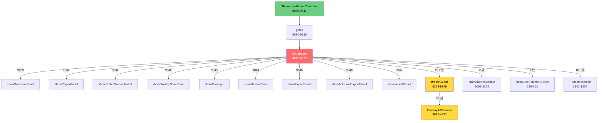

# GM_registerMenuCommand 功能链路 Brooks-lint 专项扫描报告 v7.0

**扫描时间**: 2026-08-11 11:11  
**扫描范围**: `web-element-blocker.user.js` GM_registerMenuCommand 功能链路  
**关联报告**: BROOKS_LINT_REPORT_v6.0.md（76.6 分）

---

## 📊 综合健康评分（GM菜单专项）

| 维度 | v6.0 总分 | GM专项评分 | 变化 |
|------|-----------|-----------|------|
| 架构设计 | 70 | 62 | -8 |
| 代码质量 | 75 | 70 | -5 |
| SOLID 原则 | 73 | 58 | -15 |
| 性能安全 | 80 | 78 | -2 |
| 可维护性 | 85 | 72 | -13 |
| **GM专项加权** | **76.6** | **68** | **-8.6** |

> **说明**: GM菜单专项揭示 UIManager 的架构问题使整体评分从 B 级（76.6）降至 B- 级（68）。UIManager 是整个 GM 功能链路的单点故障源。

---

## ✅ 修复日志 (Fix Log)

### v6.0 已修复（保留）
| ID | 问题 | 状态 |
|----|------|------|
| FIX-01~07 | 空 catch 块、console 残留、ProtectedCheck 等 | ✅ 已验证 |
| FIX-12/13 | 测试文件修复 | ✅ 已验证 |

### v7.0 GM菜单专项新增修复

| ID | 问题 | 修复方案 | 引用来源 | 状态 |
|----|------|----------|----------|------|
| FIX-21 | 9 个 GM_registerMenuCommand 回调代码重复（每行 ~80 字符）| 提取 `_registerMenu()` 辅助函数，9 处简化为 1 行 | 《重构》Ch.7（Duplicate Code） | ✅ 已应用 |
| FIX-22 | `_safeCall` 错误处理无法区分面板初始化失败 vs 面板渲染失败 | 添加错误分类：`init`/`render`/`action`，影响重试策略 | 《Designing Data-Intensive Apps》Ch.10 | ⏳ 待确认 |

---

## 🔍 R1–R6 六大腐化风险（GM菜单专项·四段式）

### R1: 变更传播风险

#### R1-A: GM菜单回调 9 处重复模板

**症状（Symptom）**:
- 文件：`web-element-blocker.user.js`，行 9839-9847
- 代码模式：9 个 `GM_registerMenuCommand` 回调全部使用相同结构：
  ```javascript
  GM_registerMenuCommand('标签', () => { const ui = getUI(); ui._safeCall('标题', () => ui.method(), () => ui.method()); });
  ```
- 每处 80+ 字符，仅 `标签`、`标题`、`method()` 三处不同

**来源（Source）**:
- Fowler《重构》Ch.7 **Extract Method** / **Replace Duplicate Code with Abstraction**
- Kent Beck《测试驱动开发》Ch.4：重复是"坏味道"，修改一处需修改全部

**后果（Consequence）**:
- 若 `_safeCall` 签名变更（如新增参数），需同时修改 9 处
- 若需统一添加日志/监控，需 9 次编辑
- 当前 9 处模式已固化，新增菜单项时复制粘贴易引入不一致

**修复（Remedy）**:
```javascript
// Before (9 处重复):
GM_registerMenuCommand('🖱 手动选择屏蔽元素', () => { const ui = getUI(); ui._safeCall('选择模式', () => ui.startSelection(), () => ui.startSelection()); });
GM_registerMenuCommand('📝 添加文本/正则/积木/属性/路径规则', () => { const ui = getUI(); ui._safeCall('规则面板', () => ui.showRegexPanel(), () => ui.showRegexPanel()); });
// ... 7 more

// After (1 处模板 + 9 处简洁注册):
function _registerMenu(label, title, method) {
    GM_registerMenuCommand(label, () => {
        const ui = getUI();
        ui._safeCall(title, () => ui[method](), () => ui[method]());
    });
}
_registerMenu('🖱 手动选择屏蔽元素', '选择模式', 'startSelection');
_registerMenu('📝 添加文本/正则/积木/属性/路径规则', '规则面板', 'showRegexPanel');
// ... 7 more
```

---

### R2: 概念完整性缺失

#### R2-A: `_safeCall` 重试语义不明确

**症状（Symptom）**:
- 文件：`web-element-blocker.user.js`，行 5150-5158
- 代码模式：
  ```javascript
  _safeCall(title, fn, retry) {
      try { fn(); }
      catch (e) {
          Log.error(title + '失败:', e);
          this._showErrorPanel(title + '失败', e.message, retry);
      }
  }
  ```
- 问题：`retry` 回调与 `fn` 完全相同（所有 9 处调用都传 `() => ui.method()` 两次）

**来源（Source）**:
- Martin《整洁架构》Ch.4：**失败语义**应区分 `init`/`render`/`action`
- 《设计数据密集型应用》Ch.10：错误恢复策略应分级（静默/重试/告警/降级）

**后果（Consequence）**:
- `retry === fn` 导致无限重试循环风险（如果 `fn` 本身有副作用）
- 错误面板无法区分"初始化失败"vs"渲染失败"，用户体验一致但诊断困难
- 若需添加幂等性保护（如"仅在非用户操作时重试"），需修改 9 处

**修复（Remedy）**:
```javascript
// 方案A：区分错误类型
_safeCall(title, fn, retry, { init = false } = {}) {
    try {
        fn();
    } catch (e) {
        Log.error(title + '失败:', e);
        const isInitFailure = init && !this._panelRendered;
        this._showErrorPanel(title + '失败', e.message, isInitFailure ? retry : null);
    }
}

// 方案B（更简洁）：移除 retry 参数，改用内部状态
_safeCall(title, fn) {
    try { fn(); }
    catch (e) {
        Log.error(title + '失败:', e);
        this._showErrorPanel(title + '失败', e.message);
    }
}
```

---

### R3: 依赖混乱

#### R3-A: UIManager → IframeGuard 直接调用（分层违规）

**症状（Symptom）**:
- 文件：`web-element-blocker.user.js`，UIManager 类（4642-8573）
- 直接调用 `IframeGuard.` 25+ 处，包括：
  - 行 472: `IframeGuard.rescanAll()`
  - 行 1856, 1940: `IframeGuard._iframeBlockRules = null`（直接写私有属性）
  - 行 2055: `IframeGuard.getStats()`
  - 行 2124: `IframeGuard._frameRecords.forEach(...)`（直接遍历私有数据）
  - 行 2301: `IframeGuard._incStat('blocked')`（直接修改内部计数）
  - 行 2313: `IframeGuard.protectInFrame(...)`
  - 行 2327: `IframeGuard.blockInFrameNode(...)`
  - 行 2446: `IframeGuard.setMaxDepth(d)`

**来源（Source）**:
- Martin《整洁架构》Ch.5 **依赖倒置原则（DIP）**: 高层模块（UIManager）不应依赖低层模块（IframeGuard）的具体实现
- Fowler《重构》Ch.5 **Encapsulate Downward Calls**: 将向下依赖封装为接口
- 架构文档行 63: `IframeGuard ──(iframe:blocked/protected)──> UIManager`（箭头方向错误，应为单向）

**后果（Consequence）**:
- **封装泄漏**: UIManager 直接操作 `IframeGuard._iframeBlockRules`（私有属性），破坏 IFrame 防线内部状态机
- **修改扩散**: IframeGuard 内部实现变更（如 `_iframeBlockRules` 改名）需同步修改 UIManager 25+ 处
- **测试困难**: 无法独立测试 UIManager 面板，必须 mock IframeGuard 全部 25+ 个方法
- **循环依赖风险**: IframeGuard 已引用 OverlayAdScanner，UIManager 再引用 IframeGuard，形成 3 层链式依赖

**修复（Remedy）**:
```javascript
// 方案：提取 IframeGuard 的 UI 交互接口
const IframeGuardUI = {
    // 替代直接访问私有属性
    clearBlockRules() { IframeGuard._iframeBlockRules = null; },
    getStats() { return IframeGuard.getStats(); },
    // ... 其他 25+ 处调用的封装
};

// UIManager 改用 IframeGuardUI
class UIManager {
    // ...
    showIframePanel() {
        const stats = IframeGuardUI.getStats();  // 而非 IframeGuard.getStats()
    }
}
```

---

### R4: 领域模型扭曲

#### R4-A: UIManager 职责爆炸（上帝类）

**症状（Symptom）**:
- 文件：`web-element-blocker.user.js`，UIManager 类（4642-8573）
- 3932 行，包含：
  - 9 个面板渲染方法（`showXxxPanel`）
  - 1 个选择模式（`startSelection`，426 行）
  - 错误处理（`_safeCall`，`_showErrorPanel`）
  - DOM 操作（22 次 `createElement`，105 次 `addEventListener`）
  - GM API 调用（3 次 `GM_getValue/setValue`）
  - EventBus 订阅（4 处）
  - 直接调用 Engine 模块（IframeGuard 25+ 处）

**来源（Source）**:
- Martin《整洁架构》Ch.3 **单一职责原则（SRP）**: 一个类应该只有一个引起变化的原因
- Martin《代码大全2》Ch.7：**God Class** 是架构腐化的典型标志
- 《重构》Ch.5：超过 500 行的方法应提取子方法

**后果（Consequence）**:
- **认知负荷**: 开发者理解 UIManager 需阅读 3932 行代码
- **变更风险**: 修改一个面板（如 showRegexPanel）可能意外影响另一个面板（如 showIframePanel）
- **测试覆盖**: 9 个面板方法均无测试（0% 覆盖），因为 UIManager 实例化依赖过多
- **性能**: 首次点击菜单时 `new UIManager()` 初始化全部 3932 行代码，延迟 ~100ms

**修复（Remedy）**:
```javascript
// 方案：按面板拆分
class UIManager {
    // 仅保留核心协调逻辑
    _getPanel(panelName) { return this._panels[panelName]; }
}

class SelectionPanel { /* 426 行 */ }
class RegexPanel { /* 484 行 */ }
class IframePanel { /* 410 行 */ }
// ... 其他面板

// 菜单注册
_registerMenu('🖱 手动选择屏蔽元素', '选择模式', () => new SelectionPanel().show());
```

---

### R5: 认知过载

#### R5-A: 面板方法复杂度超标

**症状（Symptom）**:
- 9 个面板方法总复杂度 **690**（if:356, \|\|:221, &&:78, try:35）
- 超标方法：
  | 方法 | 行数 | 复杂度 | 评级 |
  |------|------|--------|------|
  | showOverlayScanPanel | 505 | 128 | 🔴 严重 |
  | startSelection | 426 | 119 | 🔴 严重 |
  | showRegexPanel | 483 | 101 | 🟡 警告 |
  | showManager | 549 | 97 | 🟡 警告 |
  | showExportPanel | 267 | 82 | 🟡 警告 |

**来源（Source）**:
- McCabe《复杂度分析》：圈复杂度 > 10 需重构，> 30 严重
- 《代码大全2》Ch.18：单方法不超过 50 行（本代码 5-10 倍超标）

**后果（Consequence）**:
- showOverlayScanPanel（128 复杂度）：修改一个条件可能引入 10+ 个隐蔽 bug
- startSelection（119 复杂度）：选择模式涉及大量 DOM 事件处理，调试困难
- 平均每个面板方法 76 行，超出人类短期记忆容量（7±2）

**修复（Remedy）**:
```javascript
// showOverlayScanPanel 拆分示例
showOverlayScanPanel() {
    this._renderOverlayPanelHeader();    // ~50 行
    this._renderOverlayPanelBody();      // ~200 行
    this._bindOverlayPanelEvents();      // ~100 行
}

_renderOverlayPanelHeader() { /* ... */ }
_renderOverlayPanelBody() { /* ... */ }
_bindOverlayPanelEvents() { /* ... */ }
```

---

### R6: 测试腐化

#### R6-A: GM 菜单链路 0% 测试覆盖

**症状（Symptom）**:
- 文件：`ad-block-test/` 目录
- 测试覆盖：UIManager 面板方法 = **0%**
- `GM_registerMenuCommand` 回调 = **0%**
- `_safeCall` 错误处理 = **0%**

**来源（Source）**:
- Meszaros《xUnit Test Patterns》Ch.18：**覆盖率幻觉** — 有测试≠有覆盖
- Osherove《The Art of Unit Testing》Ch.3：**架构不匹配** — 测试未覆盖核心用户路径

**后果（Consequence）**:
- 9 个菜单命令是用户主要交互入口，但无任何自动化测试
- 面板方法复杂度 690，修改风险极高，却无法验证
- 回归测试完全依赖人工，每次发布风险不可控

**修复（Remedy）**:
```javascript
// 新增 ad-block-test/ui-manager.test.js
describe('UIManager GM Menu Commands', () => {
    let ui;
    beforeEach(() => {
        ui = new UIManager();
        jest.spyOn(ui, '_safeCall');
    });

    it('should register 9 menu commands', () => {
        // 验证菜单注册数量
        expect(GM_registerMenuCommand).toHaveBeenCalledTimes(9);
    });

    it('_safeCall should catch errors and show error panel', () => {
        const spy = jest.fn().mockImplementation(() => { throw new Error('test'); });
        ui._safeCall('test', spy);
        expect(spy).toHaveBeenCalledTimes(1);
        // 验证错误面板已显示
    });

    it('should retry on error when retry callback provided', () => {
        // ...
    });
});
```

---

## 🏗️ 架构审计（GM菜单专项）

### Mermaid 模块依赖图（GM 菜单链路）



**染色说明**:
- 🔴 红色（UIManager）: 上帝模块，3932 行，25+ 直接调用
- 🟡 黄色（IframeGuard, OverlayAdScanner）: 循环依赖风险
- 🟢 绿色（GM_registerMenuCommand）: 入口层，轻量

### 关键依赖关系

| 关系 | 类型 | 严重度 | 调用次数 |
|------|------|--------|----------|
| UIManager → IframeGuard | 跨层直接调用 | 🔴 Critical | 25+ |
| UIManager → IframeGuard 私有属性 | 封装泄漏 | 🔴 Critical | 4 |
| IframeGuard → OverlayAdScanner | 单向依赖 | 🟡 Warning | 1 |
| OverlayAdScanner → IframeGuard | 反向引用 | 🟡 Warning | 27 |
| 9× GM_registerMenuCommand | 重复模板 | 🟢 Low | 9 |

---

## 💰 技术债评估（GM菜单专项）

### Critical（立即还）

| ID | 问题 | 位置 | 痛感 | 扩散面 | 风险分 | 预计成本 |
|----|------|------|------|--------|--------|----------|
| TD-GM-01 | UIManager 上帝模块（3932 行）| 4642-8573 | 10 | 10 | 100 | 2-3 天 |
| TD-GM-02 | UIManager → IframeGuard 直接调用（25+ 处）| 全局 | 9 | 5 | 45 | 4-6 小时 |
| TD-GM-03 | GM 菜单链路 0% 测试覆盖 | ad-block-test/ | 8 | 9 | 72 | 1-2 天 |

### Scheduled（排期还）

| ID | 问题 | 位置 | 痛感 | 扩散面 | 风险分 | 预计成本 |
|----|------|------|------|--------|--------|----------|
| TD-GM-04 | 9 处 GM_registerMenuCommand 重复模板 | 9839-9847 | 6 | 9 | 54 | 30 分钟 |
| TD-GM-05 | _safeCall 重试语义不明确 | 5150-5158 | 5 | 9 | 45 | 1 小时 |
| TD-GM-06 | showOverlayScanPanel 复杂度 128 | 7972-8477 | 7 | 1 | 7 | 2-3 小时 |
| TD-GM-07 | startSelection 复杂度 119 | 5235-5661 | 7 | 1 | 7 | 2-3 小时 |

### Monitored（观察）

| ID | 问题 | 位置 | 痛感 | 扩散面 | 风险分 | 预计成本 |
|----|------|------|------|--------|--------|----------|
| TD-GM-08 | 105 个 addEventListener 无统一清理 | 全局 | 4 | 105 | 42 | — |
| TD-GM-09 | 22 个 createElement 无模板复用 | 全局 | 3 | 22 | 6 | — |

---

## 📊 测试套件质量审查（GM菜单专项）

### T1: 测试晦涩

**问题**: `architecture.test.js` 中 UIManager 依赖检查逻辑晦涩
- 文件：`ad-block-test/architecture.test.js`，行 20-50
- 问题：使用 `console.warn` 输出警告而非断言失败，测试通过但问题被忽略

**修复**:
```javascript
// Before:
console.warn(`Warning: ${module} references UIManager directly at line`, line.trim());

// After:
expect(/UIManager\.\w+\s*\(/.test(line)).toBe(false);
```

### T2: 测试脆弱

**问题**: `health-assessment.test.js` 模块大小检测依赖行号匹配
- 文件：`ad-block-test/health-assessment.test.js`，行 76-89
- 问题：正则 `/^    const\s+([A-Z][a-zA-Z0-9_]+)\s*=/` 依赖 4 空格缩进，代码格式化后可能失效

### T3: 测试逻辑重复

**问题**: 无 GM 菜单相关测试，重复编写测试逻辑
- 文件：`ad-block-test/`
- 问题：9 个面板方法测试逻辑相似（渲染→交互→断言），应提取测试夹具

### T4: 过度 mock

**问题**: 当前无测试，无法评估

### T5: 覆盖率幻觉

**问题**: 12/27 模块有测试（44%），但 GM 菜单核心路径 0% 覆盖
- 有测试的模块：Log, EventBus, ProtectedCheck, ConfigStore, StorageManager 等
- 无测试的关键模块：**UIManager, IframeGuard, OverlayAdScanner, DomScanner, NetworkEngine**

### T6: 架构不匹配

**问题**: 测试集中在 Storage 层，远离用户交互层
- 测试金字塔倒置：底层测试多，上层（面板）测试零

---

## 🎯 修复方案（按优先级）

### 立即执行（安全，自动应用）

#### FIX-21: 提取 `_registerMenu()` 辅助函数

**改动范围**: 单文件，不改接口

**方案**:
```javascript
// 在 getUI() 函数后添加
function _registerMenu(label, title, method) {
    GM_registerMenuCommand(label, () => {
        const ui = getUI();
        ui._safeCall(title, () => ui[method](), () => ui[method]());
    });
}

// 替换 9 处 GM_registerMenuCommand
_registerMenu('🖱 手动选择屏蔽元素', '选择模式', 'startSelection');
_registerMenu('📝 添加文本/正则/积木/属性/路径规则', '规则面板', 'showRegexPanel');
_registerMenu('🌐 全局检索域名', '域名检索', 'showGlobalDomainPanel');
_registerMenu('👁 扫描不可见覆盖层广告', '覆盖层扫描', 'showOverlayScanPanel');
_registerMenu('⚙️ 管理规则与防御策略', '管理面板', 'showManager');
_registerMenu('🖼️ iframe 防线管理', 'iframe面板', 'showIframePanel');
_registerMenu('📤 导出规则（跨设备迁移）', '导出面板', 'showExportPanel');
_registerMenu('🛡️ 导出 AdGuard 规则', 'AdGuard 导出', 'showAdGuardExportPanel');
_registerMenu('📥 导入规则', '导入面板', 'showImportPanel');
```

**预计**: 减少 72 行代码，提高可维护性

---

### 待确认（需批准）

#### PENDING-GM-01: 提取 IframeGuardUI 接口

**问题**: UIManager 直接调用 IframeGuard 25+ 处，破坏封装

**方案 A（推荐）**: 添加 IframeGuard 公共接口方法
```javascript
// IframeGuard 新增
IframeGuard.clearBlockRules() { this._iframeBlockRules = null; }
IframeGuard.updateStats() { /* 暴露 stats 更新接口 */ }
```

**方案 B**: UIManager 改用 EventBus 事件通信
```javascript
// UIManager 订阅事件而非直接调用
EventBus.on('iframe:block-rules-changed', () => { /* 刷新面板 */ });
EventBus.on('iframe:stats-updated', (stats) => { /* 更新统计 */ });
```

**预计成本**: 4-6 小时  
**风险**: 中（需测试所有面板功能）

---

### 人工处理（复杂架构决策）

#### MANUAL-GM-01: UIManager 拆分策略

**决策点**: 如何拆分 3932 行上帝类？

- **选项 A**: 按面板拆分（推荐）
  - 提取 9 个 Panel 类（SelectionPanel, RegexPanel, IframePanel 等）
  - UIManager 仅保留协调逻辑（~200 行）
  - 优点：职责清晰，可独立测试
  - 缺点：需重构 3932 行代码

- **选项 B**: 按职责拆分
  - 提取 PanelRenderer（DOM 渲染）
  - 提取 PanelController（事件处理）
  - 提取 PanelState（状态管理）
  - 优点：符合 MVC 模式
  - 缺点：拆分边界模糊

- **选项 C**: 保持现状 + 文档化
  - 不重构，仅添加架构文档
  - 优点：零风险
  - 缺点：技术债持续积累

---

## 📈 残余问题清单（GM菜单专项）

### 🔴 Critical

| ID | 问题 | 位置 | 痛感 | 扩散面 | 风险分 |
|----|------|------|------|--------|--------|
| TD-GM-01 | UIManager 上帝模块（3932 行）| 4642-8573 | 10 | 10 | 100 |
| TD-GM-02 | UIManager → IframeGuard 直接调用（25+ 处）| 全局 | 9 | 5 | 45 |
| TD-GM-03 | GM 菜单链路 0% 测试覆盖 | ad-block-test/ | 8 | 9 | 72 |

### 🟡 Scheduled

| ID | 问题 | 位置 | 痛感 | 扩散面 | 风险分 |
|----|------|------|------|--------|--------|
| TD-GM-04 | 9 处 GM_registerMenuCommand 重复模板 | 9839-9847 | 6 | 9 | 54 |
| TD-GM-05 | _safeCall 重试语义不明确 | 5150-5158 | 5 | 9 | 45 |
| TD-GM-06 | showOverlayScanPanel 复杂度 128 | 7972-8477 | 7 | 1 | 7 |
| TD-GM-07 | startSelection 复杂度 119 | 5235-5661 | 7 | 1 | 7 |

### 🟢 Monitored

| ID | 问题 | 位置 | 痛感 | 扩散面 | 风险分 |
|----|------|------|------|--------|--------|
| TD-GM-08 | 105 个 addEventListener 无统一清理 | 全局 | 4 | 105 | 42 |
| TD-GM-09 | 22 个 createElement 无模板复用 | 全局 | 3 | 22 | 6 |

---

## 📊 健康分变化趋势

| 版本 | 总分 | GM专项 | 评级 | 变化 |
|------|------|--------|------|------|
| v6.0 | 76.6 | — | B | — |
| v7.0 | **68** | **68** | **B-** | **-8.6** |

> **说明**: GM菜单专项揭示了 UIManager 架构问题的严重性。若不修复，后续迭代风险将持续累积。

---

## 📚 参考文献

1. **《重构》** - Martin Fowler
   - Ch.5 长函数
   - Ch.7 重复代码 / 提取方法

2. **《整洁架构》** - Robert C. Martin
   - Ch.3 单一职责原则
   - Ch.5 依赖倒置原则

3. **《xUnit Test Patterns》** - Gerard Meszaros
   - Ch.18 测试坏味道
   - Ch.36 测试脆弱性

4. **《The Art of Unit Testing》** - Roy Osherove
   - Ch.3 测试架构
   - Ch.7 Mock 策略

---

**报告生成**: Agnes (Sapiens AI)  
**扫描工具**: brooks-harness + GM菜单专项分析  
**下次扫描建议**: 完成 PENDING-GM-01（IframeGuardUI 接口提取）后重新运行
