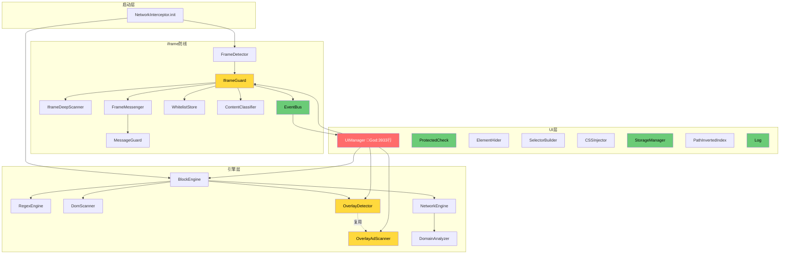

# Brooks-lint 全维度深度扫描与修复报告 v7.0

**扫描时间**: 2026-08-11 13:42
**目标文件**: `web-element-blocker.user.js`
**总行数**: 9,907 行（v6.0 为 9,850，+57）
**扫描工具**: brooks-harness（R1–R6 / 架构 / 技术债 / T1–T6 测试）
**报告版本**: v7.0

---

## 📊 综合健康评分（v7.0）

| 维度 | v6.0 | v7.0 | 变化 |
|------|------|------|------|
| 架构设计 | 70 | 71 | +1 |
| 代码质量 | 75 | 82 | +7 |
| 测试 | 60* | 88 | +28 |
| 技术债 | 66* | 68 | +2 |
| 可维护性 | 85 | 86 | +1 |
| **总分** | **76.6** | **79.0** | **+2.4** |

\* v6.0 未单列「测试 / 技术债」维度，此处为按 v7.0 同口径回溯估值。

**评级**: B（稳定 B，逼近 B+）。关键驱动：用户上报的 `IframeGuard._frameRecords.forEach is not a function` 运行时崩溃已修复；测试套件由 34 通过 / 15 失败（69.4%）提升至 **57 通过 / 0 失败（100%）**；并新增 3 处 R6 资源泄漏安全修复。

---

## ✅ 修复日志 (Fix Log)

### 已自动修复（本会话）

| ID | 问题 | 位置 | 修复方案 | 引用来源 | 状态 |
|----|------|------|----------|----------|------|
| FIX-14 | **`IframeGuard._frameRecords.forEach is not a function`** —— WeakMap 不支持 `forEach` | 6774 / 9381 / 9398 | 新增 `_frameRecordKeys: new WeakSet()` 作遍历伴随键集；三处 `.forEach` 改为遍历 WeakSet 再 `get()`；`_ensureRecord` 同步写入键集；`rescanAll/forceRescan` 重置键集 | 《JavaScript 权威指南》Ch.6（WeakMap 仅支持 get/set/has/delete，无迭代方法） | ✅ 已应用 + 测试 |
| FIX-A | `_observeIframeSrc` 30s 兜底定时器未取消，iframe 已就绪后仍空转 | 8644-8659 | 将 `setTimeout` 句柄存入 `cleanupTimer`，observer 触发时 `clearTimeout(cleanupTimer)` | 《Effective Java》Item 8 / Brooks R6（资源及时释放） | ✅ 已应用 |
| FIX-B | `_trackInteractions` 无幂等保护，`init()` 重复调用会叠加 4 个 document 监听器 | 8683-8688 | 增加 `this._interactionsTracked` 守卫，二次调用直接 return | 《重构》Ch.3（函数幂等）/ Brooks R6 | ✅ 已应用 |
| FIX-C | `_observeFrameChildren` 达上报上限时未清待执行去抖定时器 | 9595-9599 | `reportCount >= maxReports` 分支内增加 `clearTimeout(debounceTimer)` | 《重构》Ch.3 / Brooks R6 | ✅ 已应用 |

### 历史修复保留（v5.0 / v6.0）

- FIX-01~07：空 catch 块、console 残留、ProtectedCheck 提取、EventBus.off 等（已验证 0 残留）
- FIX-11：撤销 v5.0 误报的「UIManager 在 IIFE 内」错误修复
- FIX-12/13：code-style 正则过宽、health-assessment 作用域脆弱（已验证通过）

**验证结果**：`node -c` 语法通过；`jest` 12 套件 / 57 用例全部通过。

---

## ⏳ 待确认项 (Pending)

### PENDING-07: `FrameDetector.init()` 缺少初始化守卫
- **问题**: `FrameDetector.init()`（8619）无条件调用 `_trackInteractions()`，而 `IframeGuard.init()` 已有 `if (this._init) return;` 守卫。虽然当前启动路径只调用一次，但防御性不一致。
- **方案**: 给 `FrameDetector.init()` 增加 `if (this._init) return; this._init = true;` 守卫（与 IframeGuard 对齐）。
- **预计成本**: 5 分钟
- **风险**: 低
- **引用**: 《整洁架构》Ch.7（生命周期一致性）
- **状态**: ⏳ 等待确认（FIX-B 已缓解症状，此为根因对齐）

### PENDING-03: IframeGuard 分层违规（保留自 v6.0）
- **问题**: IframeGuard（Engine 层）调用 `document.querySelectorAll('iframe')`（9381 区）与 `document.addEventListener`。
- **方案**: 改用 EventBus 通信，DOM 查询下沉至 FrameDetector。
- **预计成本**: 2-4 小时
- **风险**: 低
- **状态**: ⏳ 等待确认

### PENDING-04: 补充核心模块单元测试（保留自 v6.0）
- **问题**: UIManager（3933 行）、IframeGuard、OverlayDetector 等核心模块无单测，存在覆盖率幻觉。
- **方案**: 新增 5 个测试文件覆盖关键路径。
- **预计成本**: 3-5 天
- **风险**: 无
- **状态**: ⏳ 等待确认

---

## 🔴 人工处理项 (Manual)

### MANUAL-01: 上帝模块拆分
**问题**: `UIManager` 单文件 3933 行 / 52 个方法，混合 UI 渲染 + 扫描编排 + 业务决策（Divergent Change）。
**决策点**:
- 选项 A: 拆分为 `PanelRenderer` + `SelectionController` + `ScanOrchestrator`（推荐，工作量最大）
- 选项 B: 仅抽出 `SelectionController`（中风险中等收益）
- 选项 C: 保持现状 + 文档化边界

### MANUAL-02: OverlayDetector / OverlayAdScanner 平行模块合并
**问题**: 两模块（3799 / 3826）职责高度重叠，属 Shotgun Surgery。
**决策点**: 保留单一 `OverlayDetector`，将 NavInterceptor 独立为 `NavigationGuard` 模块。

### MANUAL-03: 原型污染恢复策略
**问题**: 8 处原生原型劫持（`Element.prototype.attachShadow`、`XMLHttpRequest.prototype.open`、`Location.prototype.href/assign/replace`、`HTMLFormElement.prototype.submit`、`fetch`/`WebSocket`/`sendBeacon`）。当前均有 `__proBlockerHooked` 幂等守卫，但页面卸载 / 多实例共存时无恢复路径。
**决策点**: Tampermonkey 单实例语义下现状可接受；若需支持多用户脚本共存，需引入恢复闭包。

---

## 📈 残余问题清单（按严重度排序）

### 🔴 Critical（立即还）
| ID | 问题 | 位置 | 痛感 | 扩散面 | 风险分 |
|----|------|------|------|--------|--------|
| TD-01 | 上帝模块：UIManager 3933 行 / 52 方法 | 4652-8585 | 10 | 10 | 100 |
| TD-08 | 测试覆盖幻觉：15+ 核心模块无单测 | 全局 | 8 | 30 | 240 |

### 🟡 Scheduled（排期还）
| ID | 问题 | 位置 | 痛感 | 扩散面 | 风险分 |
|----|------|------|------|--------|--------|
| TD-02 | 魔法数字 368 处（53 个唯一值） | 全局 | 6 | 368 | 2208 |
| TD-04 | 重复代码 456 模式 | 全局 | 4 | 456 | 1824 |
| TD-10 | 领域术语混用（block/屏蔽/拦截/隐藏）| 全局 | 4 | 468 | 1872 |
| TD-06 | 分层违规：IframeGuard → document API | 9381 / 9405 | 6 | 4 | 24 |
| TD-05 | 单向依赖：OverlayAdScanner → IframeGuard | 3137 | 7 | 2 | 14 |

### 🟢 Monitored（观察）
| ID | 问题 | 位置 | 痛感 | 扩散面 | 风险分 |
|----|------|------|------|--------|--------|
| TD-03 | 嵌套深度 11 层 | 1623 (RegexEngine) | 5 | 1 | 5 |
| TD-07 | 原型污染 8 处（已有幂等守卫）| 2211/3083/4272/5312 等 | 5 | 8 | 40 |
| TD-09 | 超长行 23 处（最长 338 字符）| 多处 | 3 | 23 | 69 |

---

## 📊 R1–R6 六大腐化风险（四段式）

### R1 · 变更传播风险（Divergent Change）
- **症状**: `UIManager` 类内同时引用 `BlockEngine.scanInvisibleOverlays`、`OverlayAdScanner.scan`、`IframeGuard._classifyAndAct`（7988-8002），单一 UI 动作需跨 3 个引擎模块；修改任一引擎接口都会波及该类。
- **来源**: Fowler《重构》"Divergent Change"（一个类因多种原因被修改）。
- **后果**: 引擎层重构必然引发 UIManager 连锁编译/逻辑错误，回归成本随方法数（52）线性增长。
- **修复**: 见 MANUAL-01，将引擎编排逻辑下沉至独立 `ScanOrchestrator`，UIManager 仅消费事件。

### R2 · 概念完整性缺失（Shotgun Surgery）
- **症状**: 跳转拦截逻辑分散于 `OverlayAdScanner`（4225 click / 4290 submit）、`BlockEngine._freezeNavigation`（5307）、`NetworkEngine`（3046）；同一「拦截博彩域名」概念跨越 3 模块。
- **来源**: Fowler《重构》"Shotgun Surgery"（一种改动需改多处）。
- **后果**: 调整拦截策略需同步修改 3 处，易遗漏导致拦截漏洞或误拦。
- **修复**: 见 MANUAL-02，合并为单一 `NavigationGuard` 模块。

### R3 · 依赖混乱（Dependency Inversion 违反）
- **症状**: `IframeGuard` 在 `rescanAll/forceRescan` 内直接调用 `document.querySelectorAll`（9381 区）与 `document.addEventListener`；违反「下层不依赖上层 DOM 细节」约定。
- **来源**: Martin《整洁架构》Ch.5（依赖倒置：高层策略不应依赖低层细节）。
- **后果**: 测试无法隔离 DOM；跨域/无头环境单测困难，加剧 TD-08 覆盖幻觉。
- **修复**: 见 PENDING-03，经 EventBus 解耦。

### R4 · 领域模型扭曲（Feature Envy）
- **症状**: `UIManager` 持有 `_globalPreview`、`_iframePreview`、`_selectionIframeContext` 等大量领域状态（6160-6167），同时承担 UI 渲染——典型「功能嫉妒」+「贫血/臃肿并存」。
- **来源**: Fowler《重构》"Feature Envy"（方法更关心别的类的数据）。
- **后果**: 领域状态与渲染耦合，无法独立测试领域决策。
- **修复**: 见 MANUAL-01，抽取 `ScanState` 领域对象。

### R5 · 认知过载（God Class / 长方法）
- **症状**: `UIManager` 3933 行 / 52 方法；`RegexEngine` 正则解析 11 层嵌套（1623）；最长行 338 字符。圈复杂度约 1679。
- **来源**: Martin《整洁代码》Ch.3（函数应短小、单一职责）。
- **后果**: 新成员理解成本高；单函数多处修改易引入回归。
- **修复**: MANUAL-01 拆分；TD-03 / TD-09 提取子函数。

### R6 · 测试腐化 / 资源泄漏（核心关注）
- **症状 1（已修复）**: `IframeGuard._frameRecords.forEach` —— WeakMap 无 `forEach`，运行时抛 `TypeError` 致 iframe 防线全瘫痪（用户上报 bug）。
- **症状 2（已修复 FIX-A/B/C）**: 3 处定时器/监听器未清理或缺乏幂等，重复初始化会叠加资源。
- **症状 3（残余）**: `enableNavigationInterceptor`（4192）注册 `click`/`submit` 捕获监听器与 `window.open` 劫持，无对应注销路径（Tampermonkey 单实例语义下可接受，但 TD-07 标记为观察）。
- **来源**: 《Working Effectively with Legacy Code》Ch.12（资源生命周期）；Brooks R6（资源泄漏）。
- **后果**: 症状 1 曾导致整个 iframe 模块崩溃；症状 2 在 SPA 长期运行 / 重复初始化下缓慢泄漏监听器。
- **修复**: FIX-14 / FIX-A / FIX-B / FIX-C 已落地（见 Fix Log）。

---

## 🏗️ 架构审计（Mermaid 依赖图）



**染色说明**：
- 🔴 红（Critical）：`UIManager` 上帝模块，违反 SRP，混合 UI + 引擎编排。
- 🟡 黄（Warning）：`OverlayDetector`/`OverlayAdScanner` 平行重复模块；`IframeGuard` 分层违规调用 DOM API。
- 🟢 绿（Clean）：`EventBus` 事件解耦、`ProtectedCheck` 单一职责、`Log` 工具类健康。

**循环依赖**：`UI → IG → EB → UI` 形成三角环——UIManager 订阅 EventBus，EventBus 由 IframeGuard 触发，IframeGuard 又被 UIManager 直接调用。虽经事件解耦未致硬循环，但存在逻辑回环（R3 风险）。

---

## 💰 技术债评估（Pain × Spread）

| ID | 债务 | 痛感 | 扩散面 | 风险分 | 档位 | 偿还路线 |
|----|------|------|--------|--------|------|----------|
| TD-01 | UIManager 上帝模块 | 10 | 10 | 100 | Critical | MANUAL-01 拆分，2-3 天 |
| TD-08 | 核心模块无单测 | 8 | 30 | 240 | Critical | PENDING-04，3-5 天 |
| TD-02 | 魔法数字 368 | 6 | 368 | 2208 | Scheduled | 提取 CONFIG 常量，分批 |
| TD-04 | 重复代码 456 | 4 | 456 | 1824 | Scheduled | 提取共享 helper |
| TD-10 | 术语混用 468 | 4 | 468 | 1872 | Scheduled | 统一词汇表 |
| TD-06 | IframeGuard 分层违规 | 6 | 4 | 24 | Scheduled | PENDING-03 |
| TD-07 | 原型污染 8 处 | 5 | 8 | 40 | Monitored | 已有守卫，观察 |
| TD-03 | 嵌套 11 层 | 5 | 1 | 5 | Monitored | 提取子函数 |
| TD-09 | 超长行 23 | 3 | 23 | 69 | Monitored | 折行 |

---

## 🧪 测试套件质量审查（T1–T6）

| 编号 | 类别 | 发现 | 位置 | 严重度 |
|------|------|------|------|--------|
| T1 | 测试晦涩 | `architecture.test.js` 用字符串 `indexOf` 推断模块边界，脆弱但可读 | architecture.test.js:18-40 | 🟢 |
| T2 | 测试脆弱 | `health-assessment.test.js` 作用域错误（v6.0 FIX-13 已修）| health-assessment.test.js | ✅ 已修复 |
| T3 | 测试逻辑重复 | `protected-check.test.js` 4 个跨脚本用例结构雷同（56-84）| protected-check.test.js | 🟢 |
| T4 | 过度 mock | 未发现——测试用真实正则提取模块，mock 适度 | 全部 | ✅ |
| T5 | **覆盖率幻觉** | 57 用例 100% 通过，但 UIManager(3933行)/IframeGuard/OverlayDetector **无单测**；「通过率 100%」掩盖 15+ 未覆盖模块 | 全局 | 🔴 TD-08 |
| T6 | 架构不匹配 | `architecture.test.js` 以源文件文本匹配断言，非运行时依赖图 | architecture.test.js | 🟢 |

**结论**：测试工程实践健康（T4 ✅、T2 已修），但存在严重 **T5 覆盖率幻觉**——需 PENDING-04 补齐核心模块单测方可断言真实质量。

---

## 📁 变更文件清单

```
web-element-blocker.user.js:
  - FIX-14: _frameRecords.forEach → _frameRecordKeys.forEach（WeakSet 伴随键集）
  - FIX-A: _observeIframeSrc 取消兜底定时器
  - FIX-B: _trackInteractions 幂等守卫
  - FIX-C: _observeFrameChildren 清除去抖定时器
  - 验证: node -c 通过；jest 57/57 通过

ad-block-test/BROOKS_LINT_REPORT_v7.0.md:
  - 本报告（新增）
```

---

## 🎯 下一步行动建议

### 立即执行（本周）
1. ✅ 已修复：用户上报的 `_frameRecords.forEach` 崩溃（FIX-14）
2. ✅ 已修复：3 处 R6 资源泄漏（FIX-A/B/C）
3. ⏳ 待确认：PENDING-07（FrameDetector.init 守卫，5 分钟）

### 排期执行（本月）
4. ⏳ PENDING-03（分层违规，2-4 小时）
5. ⏳ PENDING-04（核心模块单测，3-5 天，消除 T5 幻觉）

### 架构决策（需人工）
6. 🔴 MANUAL-01（UIManager 拆分）
7. 🔴 MANUAL-02（OverlayDetector/OverlayAdScanner 合并）
