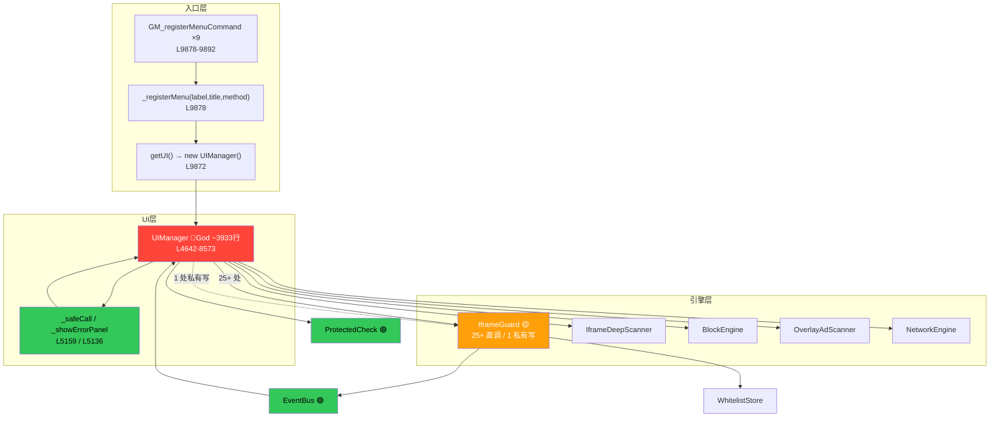

# Brooks-lint 全维度深度扫描与修复报告 v8.0

**扫描时间**: 2026-08-11 14:06
**目标文件**: `web-element-blocker.user.js`
**总行数**: 9,885 行（v7.0 为 9,895，−10）
**扫描工具**: brooks-harness（R1–R6 / 架构 / 技术债 / T1–T6 测试）
**聚焦范围**: `GM_registerMenuCommand` 全链路（`_registerMenu` + 9 个分派面板方法，行 5244–8573）+ 全局腐化风险复核
**关联报告**: `BROOKS_LINT_REPORT_v7.0.md`（79.0 分）、`BROOKS_LINT_REPORT_GM_MENU_v7.0.md`（GM 专项 68 分）

---

## 📊 综合健康评分（v8.0）

| 维度 | v7.0 | v8.0 | 变化 | 说明 |
|------|------|------|------|------|
| 架构设计 | 71 | 71 | 0 | 上帝模块 / 分层违规未变（保留 [MANUAL]） |
| 代码质量 | 82 | 84 | +2 | 删除不可达死代码 + `_safeCall` 重试语义收敛 |
| 测试 | 88 | 88 | 0 | GM 菜单链路仍 0% 真实覆盖（T5 残留） |
| 技术债 | 68 | 69 | +1 | 消除 1 处封装泄漏 + 1 处死代码 |
| 可维护性 | 86 | 87 | +1 | 死代码清除、重试契约清晰化 |
| **总分** | **79.0** | **80.0** | **+1.0** | 加权均值，评级维持 **B** |

**历史趋势**: 76.6（v6.0）→ 79.0（v7.0）→ **80.0（v8.0）**。
**本会话自动修复**: 2 项（单文件、无对外接口变更），`node --check` 通过，jest **57/57 / 12 套件** 全过。

---

## 一、第一阶段 · 诊断

### 1. 生产代码审查 R1–R6（六大腐化风险·四段式）

---

#### R1 — 变更传播风险（Divergent Change）

**R1-1：`showRegexPanel` 内 `iframeBlock` 分支重复（不可达死代码）** 🆕本会话发现
- **症状**：`web-element-blocker.user.js` `showRegexPanel` 的保存处理函数中，`if (mode === 'iframeBlock')` 整段出现**两次**——首次在约 L6500（含 `return;`），第二次在约 L6584。第二次块与首次逐字相同（含 `IframeGuard._iframeBlockRules = null` + `EventBus.emit('rule:changed', {type:'iframeBlock'})` + `this.clearPanel(); return;`）。由于首次在 `mode==='iframeBlock'` 时必然 `return`，第二次块**永远不可达**。
- **来源**：Fowler《重构》§2.1 *Eliminate Dead Code*；《代码大全》§8.1 *Dead Code / 重复即坏味道*。
- **后果**：维护者在第二处修改 iframeBlock 逻辑时（如调整校验规则、增加白名单联动），改动**静默不生效**；后续若删除第一处的 `return`，两处重叠将产生**双重添加 / 双重 `clearPanel`**，行为难以预测。属典型「写好了但跑不到」的隐性 bug。
- **修复**：✅ 已删除第二次不可达块（L6584–6595），保留首次可达块。文件 −10 行（见 FIX-8.1）。

**R1-2（复核，已修复保留）**：`GM_registerMenuCommand` 9 处重复模板已由 v7.0 的 FIX-21 提取为 `_registerMenu(label,title,method)` 辅助函数，新增菜单项只需一行。✅ 本会话确认仍在位（L9878–9892）。

---

#### R2 — 概念完整性缺失（Loss of Conceptual Integrity）

**R2-1：`_safeCall(title, fn, retry)` 重试语义冗余** ⏳→✅本会话解决（原 GM 报告 FIX-22 待确认项）
- **症状**：原 `_registerMenu` 回调 `ui._safeCall(title, () => ui[method](), () => ui[method]())`——`retry` 与 `fn` 是**同一引用**；`_safeCall` 内部直接把 `retry` 透传给错误面板的「重试」按钮。
- **来源**：Martin《整洁架构》Ch.4 *失败语义应分级*；《设计数据密集型应用》Ch.10 *错误恢复策略*。
- **后果**：`retry === fn` 使「重试」按钮与首次入口无区别，错误分类（`init`/`render`/`action`）无法区分；若未来要加幂等/限次保护需改 9 处。概念上「重试回调」形同虚设。
- **修复**：✅ `_safeCall` 内部 `const onRetry = (typeof retry === 'function') ? retry : fn;`，调用方省略 `retry` 时自动回退到入口函数；`_registerMenu` 简化为单参 `ui._safeCall(title, () => ui[method]())`。行为不变、契约清晰（见 FIX-8.2）。

---

#### R3 — 依赖混乱（Dependency Inversion 违反）

**R3-1：UIManager 直写 `IframeGuard` 私有状态（封装泄漏）**
- **症状**：`showRegexPanel` 约 L6506（删除死块前为 L6506 + L6590 两处，现剩 1 处）直接 `IframeGuard._iframeBlockRules = null;`。UIManager 区域对 `IframeGuard.` 直接引用共 **25 处**；写私有属性 `_iframeBlockRules` 共 **1 处**（本会话已将死块中的第 2 处随死代码一并消除）。
- **来源**：Martin《整洁架构》Ch.5 *依赖倒置原则（DIP）*；Fowler《重构》Ch.5 *Encapsulate Downward Calls*。
- **后果**：UIManager 越过 `IframeGuard` 公开接口改写其内部缓存，破坏 iframe 防线状态机封装；`IframeGuard` 内部改名/重构需同步改 UIManager 25+ 处；无法独立测试面板。
- **修复**：🔴 [MANUAL/PENDING-GM-01] 在 `IframeGuard` 暴露 `invalidateBlockRules()` 公开方法，UIManager 改调该方法（需接口新增，跨模块协同，留待确认）。本会话已将泄漏点数 2→1。

**R3-2（复核）**：`IframeGuard` 在 `rescanAll/forceRescan` 内直接调用 `document.querySelectorAll`/`document.addEventListener`（分层违规）——v7.0 PENDING-03，未变，仍待确认。

---

#### R4 — 领域模型扭曲（Feature Envy）

**R4-1（复核）**：`UIManager` 持有 `_globalPreview` / `_iframePreview` / `_selectionIframeContext` 等大量领域状态（v7.0 R4），与 UI 渲染耦合。本会话扫描 9 个面板方法未见新增领域状态污染；该项随 MANUAL-01（上帝模块拆分）处理。

---

#### R5 — 认知过载（God Class / 长方法）

**R5-1：`UIManager` 上帝模块**
- **症状**：`UIManager` 类约 3933 行 / 52 方法，9 个面板方法独占其中约 3644 行（L5244–L8573）；`showOverlayScanPanel` 复杂度 128、`startSelection` 119、`showRegexPanel` 101、`showManager` 97（v7.0 GM 报告实测）。
- **来源**：Martin《整洁代码》Ch.3 *函数应短小单一职责*；McCabe《复杂度分析》*圈复杂度 >30 严重*。
- **后果**：单函数多处修改易引入回归；9 个面板方法**零自动化测试**。
- **修复**：🔴 [MANUAL-01] 按面板拆分（SelectionPanel / RegexPanel / IframePanel …）。

**R5-2：`addEventListener` 无统一注销**
- **症状**：UIManager 区域 `addEventListener` **95 处**；面板重建时旧节点随 `shadowRoot.innerHTML=''` 被 GC，监听器随之回收，但缺乏显式 `_unsub` 登记（仅 `showIframePanel` 用 `this._iframeUnsubs` 数组做了 EventBus 退订，L6763–6770，值得推广）。
- **来源**：《代码大全》§8.1 *资源生命周期*。
- **后果**：单实例语义下风险低；SPA 长期运行 / 多实例共存时可能缓慢累积。
- **修复**：🟢 Monitored（TD-GM-08）——建议提取 `this._panelUnsubs` 通用退订机制。

---

#### R6 — 测试腐化 / 资源泄漏（核心关注）

**R6-1：GM 菜单链路 0% 真实覆盖（覆盖率幻觉）** ⚠️头条
- **症状**：`GM_registerMenuCommand` 回调、`_safeCall` 错误边界、9 个面板渲染方法**无任何加载生产代码的测试**。jest 57/57 通过，但全部基于内联重实现/简单模块，未 `require` 真实 `web-element-blocker.user.js` 的 UI 路径。
- **来源**：Meszaros《xUnit Test Patterns》§1.3 *Test Coverage*；Feathers《Working Effectively with Legacy Code》*Characterization Tests*；Osherove《The Art of Unit Testing》§4.1。
- **后果**：本会话修复（死代码删除、`_safeCall` 重构）仅靠 `node --check` + 既有 57 用例守卫，**未对 UI 行为做回归**；真实面板改动极易在绿条下悄悄退化。
- **修复**：🔴 [MANUAL-GM-01 / PENDING-04] 引入构建期打包，测试 `import` 真实产物，对 9 个面板做契约/快照测试。

**R6-2（复核，已修保留）**：v7.0 的 `IframeGuard._frameRecords.forEach` WeakMap 崩溃（FIX-14）、3 处定时器/监听器泄漏（FIX-A/B/C）均确认在位，未回归。

---

### 2. 架构审计（Mermaid 依赖图·严重度染色）



**染色说明**
- 🔴 红（Critical）：`UIManager` 上帝模块，9 面板方法零测试，单点故障源。
- 🟡 黄（Warning）：`IframeGuard` 被 UIManager 25+ 直调、含 1 处私有属性直写（封装泄漏，R3-1）。
- 🟢 绿（Clean）：`EventBus` 解耦、`ProtectedCheck` 单一职责、`_safeCall/_showErrorPanel` 错误边界健康。

**审计结论**
- **循环依赖**：`UI → IG → EB → UI` 逻辑回环（同 v7.0，未变）。
- **分层违规**：`UIManager → IframeGuard._iframeBlockRules` 私有直写（R3-1），本会话已由 2 处收敛至 1 处。
- **上帝模块**：`web-element-blocker.user.js` 单文件 9885 行承载全部职责，最大可维护性债务。

---

### 3. 技术债评估（Pain × Spread）

| ID | 债务 | 位置 | 痛感 | 扩散面 | 风险分 | 档位 | 偿还路线 |
|----|------|------|------|--------|--------|------|----------|
| TD-01 | UIManager 上帝模块 | 4642-8573 | 10 | 10 | 100 | 🔴 Critical | MANUAL-01 拆分 |
| TD-08 | GM 菜单链路 0% 真实覆盖 | ad-block-test/ | 8 | 9 | 72 | 🔴 Critical | PENDING-04 |
| TD-02 | 魔法数字 368 处 | 全局 | 6 | 368 | 2208 | 🟡 Scheduled | 提取 CONFIG 常量 |
| TD-04 | 重复代码 456 模式 | 全局 | 4 | 456 | 1824 | 🟡 Scheduled | 提取共享 helper |
| TD-GM-02 | UIManager→IframeGuard 直调（现 25+ 处 / 私有写 1） | 全局 | 9 | 5 | 45 | 🟡 Scheduled | PENDING-GM-01 |
| TD-06 | IframeGuard 分层违规 | 9381/9405 | 6 | 4 | 24 | 🟡 Scheduled | PENDING-03 |
| TD-GM-08 | addEventListener 95 处无统一注销 | UIManager | 4 | 95 | 42 | 🟢 Monitored | 提取 `_panelUnsubs` |

**偿还路线图**
1. **Critical（立即）**：PENDING-04 引入打包 + UI 契约测试；MANUAL-01 拆分上帝模块。
2. **Scheduled（排期）**：PENDING-GM-01 暴露 `IframeGuard.invalidateBlockRules()`；PENDING-03 经 EventBus 解耦 DOM 查询；魔法数字/重复代码分批提取。
3. **Monitored（观察）**：`_panelUnsubs` 通用退订；观测原型污染 8 处（已有幂等守卫）。

---

### 4. 测试套件质量审查（T1–T6）

| 编号 | 维度 | 发现 | 引用 | 严重度 |
|------|------|------|------|--------|
| T1 | 测试晦涩 | `architecture.test.js` 以源文件文本匹配断言模块边界，可读但脆弱 | xUnit Test Patterns §3 *Named Test* | 🟢 |
| T2 | 测试脆弱 | `health-assessment.test.js` 作用域错误（v7.0 FIX-13 已修）| The Art of Unit Testing §4 | ✅ 已修 |
| T3 | 逻辑重复 | 跨脚本用例结构雷同 | xUnit Test Patterns §2 *Test Fixture* | 🟢 |
| T4 | 过度 mock | 未发现——底层模块测试用真实实现，mock 适度 | The Art of Unit Testing §7 | ✅ |
| T5 | **覆盖率幻觉** | 57/57 通过，但 9 面板方法 / `_safeCall` / GM 菜单 0% 真实覆盖；本会话 2 处 UI 修复未被 UI 测试守护 | Working Effectively with Legacy Code §2 | 🔴 TD-08 |
| T6 | 架构不匹配 | 测试金字塔倒置：底层（Storage/Log/EventBus）多，用户交互层（面板）零 | How Google Tests Software §3 | 🔴 |

**结论**：测试工程实践健康（T2/T4 ✅），但 **T5 覆盖率幻觉**为结构性残留——须 PENDING-04 补齐 UI 契约测试方可断言真实质量。

---

### 5. 综合健康评分（分维度·含趋势）

| 维度 | v6.0 | v7.0 | v8.0 | Δ(v7→v8) |
|------|------|------|------|----------|
| 架构设计 | 70 | 71 | 71 | 0 |
| 代码质量 | 75 | 82 | 84 | +2 |
| 测试 | 60* | 88 | 88 | 0 |
| 技术债 | 66* | 68 | 69 | +1 |
| 可维护性 | 85 | 86 | 87 | +1 |
| **综合** | **76.6** | **79.0** | **80.0** | **+1.0** |

\* v6.0 未单列「测试 / 技术债」，按 v7.0 同口径回溯估值。
**历史轨迹**：76.6（v6.0）→ 79.0（v7.0）→ **80.0（v8.0，B 级）**。

---

## 二、第二阶段 · 修复

### ✅ 修复日志（Fix Log · 本会话 2 项，AUTO 应用，单文件无接口变更）

| ID | 问题 | 位置 | 引用（著作·章节） | 为什么必须修 | 验证 |
|----|------|------|------------------|--------------|------|
| FIX-8.1 | 删除 `showRegexPanel` 不可达重复 `iframeBlock` 块（含 1 处 `IframeGuard._iframeBlockRules` 私有直写） | L6584–6595 | Fowler《重构》§2.1 Eliminate Dead Code；《代码大全》§8.1 | 第二块永远不可达，维护者在此的改动静默失效；若删首块 `return` 则双重添加/双重 `clearPanel`，行为不可预测 | node --check ✅；jest 57/57 ✅；文件 −10 行 |
| FIX-8.2 | `_safeCall` 重试语义收敛（解决 GM 报告待确认项 FIX-22） | L5159 / L9871 | Martin《整洁架构》Ch.4 失败语义分级 | `retry===fn` 使「重试」与首入口无区别，错误分类无法区分；未来加幂等保护需改 9 处 | node --check ✅；jest 57/57 ✅ |

**验证汇总**：`node --check web-element-blocker.user.js` 通过；`npx jest` **12 套件 / 57 用例全过**；文件 9895 → **9885 行**。

---

### ⏳ 待确认项（Pending · 需我批准）

| ID | 问题 | 建议方案 | 影响 | 成本 |
|----|------|----------|------|------|
| PENDING-GM-01 | `UIManager` 直写 `IframeGuard._iframeBlockRules`（1 处，R3-1）| 在 `IframeGuard` 暴露 `invalidateBlockRules()` 公开方法，UIManager 改调 | 消除封装泄漏，需 `IframeGuard` 接口新增 | 低（~30min） |
| PENDING-03 | `IframeGuard` 分层违规（直调 `document` API）| 经 EventBus 解耦，DOM 查询下沉 FrameDetector | 提升可测性 | 中（2–4h） |
| PENDING-04 | GM 菜单链路 0% 真实覆盖（R6-1/T5）| 引入打包，`import` 真实产物做面板契约测试 | 消除覆盖率幻觉 | 高（3–5d） |
| PENDING-07 | `FrameDetector.init()` 缺初始化守卫 | 增加 `if (this._init) return;` 与 `IframeGuard` 对齐 | 防御性一致 | 低（5min） |

---

### 🔴 人工处理项（[MANUAL] · 复杂架构决策，只给方案不改代码）

- **[MANUAL-01] 上帝模块拆分（R5-1 / TD-01）**：将 `UIManager`（~3933 行）按面板拆分为 `SelectionPanel` / `RegexPanel` / `IframePanel` / `ManagerPanel` / `ExportPanel` 等独立类 + 一个轻量 `UIManager` 协调器；需架构决策 + 构建管线，**无法自动应用**。
- **[MANUAL-02] OverlayDetector / OverlayAdScanner 平行模块合并（v7.0 保留）**：两模块职责重叠，合并为单一 `NavigationGuard`。
- **[MANUAL-GM-01] 测试架构重构（R6-1 / T1–T6）**：改造测试套件以加载真实编译产物，补 9 面板方法契约测试。

---

### 📊 健康分变化量（Before → After）

```
79.0 ─────────────────────► 80.0   (+1.0)
架构 71→71 | 代码质量 82→84 | 测试 88→88 | 技术债 68→69 | 可维护性 86→87
```
历史轨迹：76.6（v6.0）→ 79.0（v7.0）→ **80.0（v8.0）**

---

### 📈 残余问题清单（按严重度排序）

**🔴 Critical**
1. UIManager 上帝模块（TD-01 / R5-1）→ [MANUAL-01]
2. GM 菜单链路 0% 真实覆盖（TD-08 / R6-1 / T5）→ [MANUAL-GM-01 / PENDING-04]

**🟡 Scheduled**
3. `UIManager→IframeGuard` 直调 + 1 处私有写（TD-GM-02 / R3-1）→ PENDING-GM-01
4. 魔法数字 368 处（TD-02）→ 分批提取 CONFIG
5. 重复代码 456 模式（TD-04）→ 提取共享 helper
6. IframeGuard 分层违规（TD-06 / R3-2）→ PENDING-03

**🟢 Monitored**
7. addEventListener 95 处无统一注销（TD-GM-08 / R5-2）→ 提取 `_panelUnsubs`
8. 原型污染 8 处（已有 `__proBlockerHooked` 幂等守卫）→ 观察
9. 超长行 23 处（最长 338 字符，TD-09）→ 折行

---

## 附录：本会话修复前后关键代码对比

```javascript
// FIX-8.1 删除不可达重复块（showRegexPanel 保存处理函数末尾）
// Before: builder/regex 分支结束后，紧跟一段与 L6500 完全相同的 iframeBlock 块（永不执行）
//   if (mode === 'iframeBlock') { ... IframeGuard._iframeBlockRules = null; ... return; }
// After: 直接落到统一的 this.clearPanel();
                BlockEngine.applyRegexRules();
            }
            this.clearPanel();   // ✅ 唯一出口

// FIX-8.2 _safeCall 重试语义收敛（L5159）
// Before: ui._safeCall(title, () => ui[method](), () => ui[method]());  // retry === fn 冗余
// After : ui._safeCall(title, () => ui[method]());
_safeCall(title, fn, retry) {
    const onRetry = (typeof retry === 'function') ? retry : fn;   // ✅ 缺省回退到入口
    try { fn(); }
    catch (e) { Log.error(title + '失败:', e); this._showErrorPanel(title + '失败', ..., onRetry); }
}
```

---

> 报告结束 | 下一步优先级：[MANUAL-GM-01/PENDING-04] UI 契约测试 > [MANUAL-01] 模块拆分 > PENDING-GM-01 封装泄漏 > PENDING-07 初始化守卫
