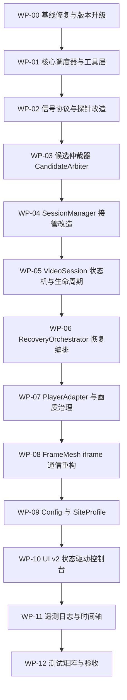
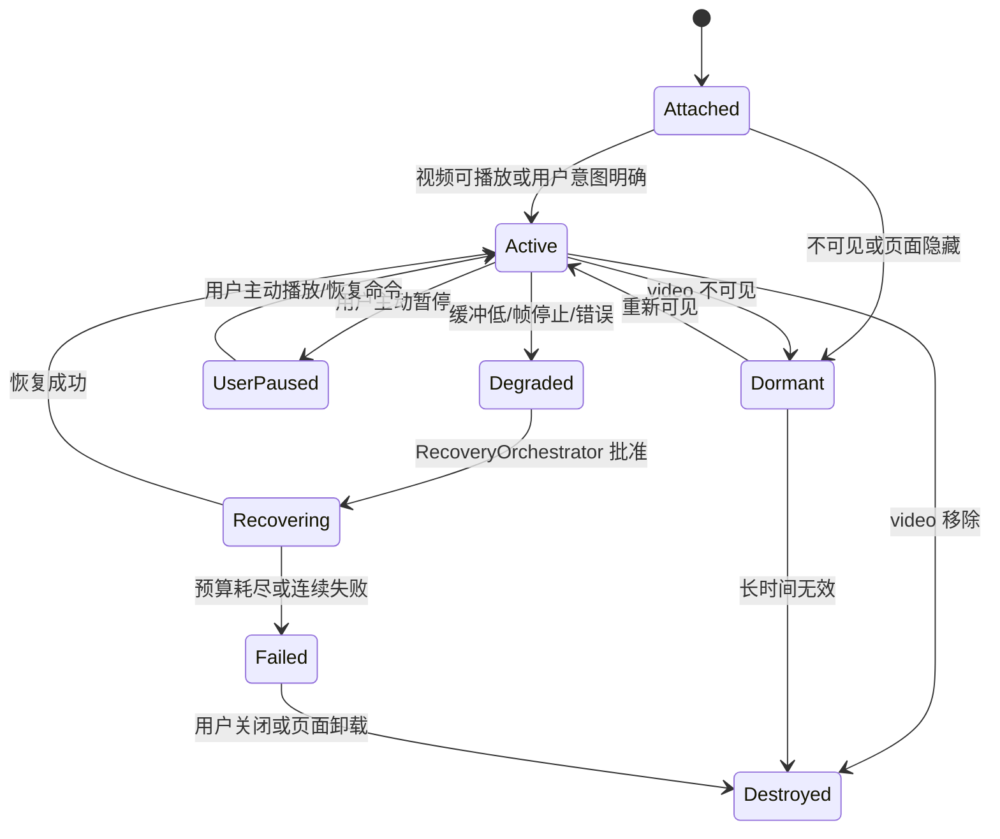
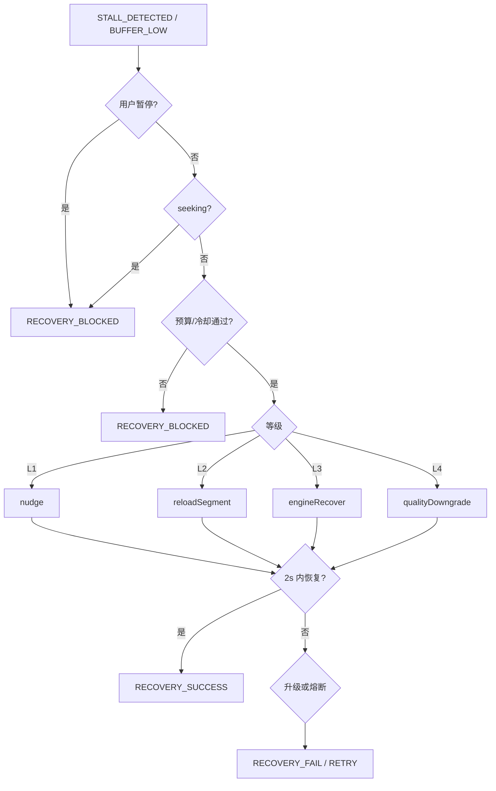
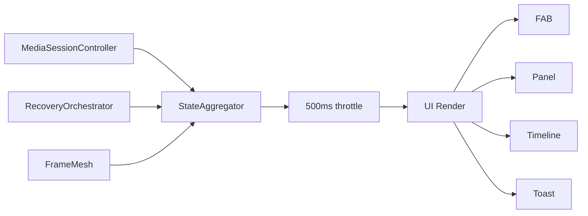

> 严格按照 WP-00 到 WP-12 的顺序执行，每完成一个工作包必须输出变更摘要、风险点、验证方式，未通过验收不得进入下一步。

---

# 视频加速脚本 v19 模型执行重构方案

## 0. 方案目标

本方案用于指导模型对现有 `video-accelerator.user.js v18.1` 进行工程化重构，最终形成 v19 架构。

核心目标：

1. **视频检测快速准确**
   - 保留原型 hook、手势预启动、DOM 扫描、iframe 穿透；
   - 引入候选池、评分、站点规则，避免误接管；
   - 主视频识别更稳定。

2. **视频接管稳定**
   - 不重复接管；
   - 不覆盖用户暂停；
   - 不在用户 seek 时错误恢复；
   - session 生命周期清晰。

3. **恢复策略可控**
   - 分级恢复；
   - 恢复预算；
   - 冷却时间；
   - 失败熔断；
   - 直播 / 点播区分。

4. **UI 美观清晰**
   - 状态驱动；
   - FAB 状态环；
   - 面板卡片化；
   - 日志可过滤；
   - 时间轴可视化；
   - 设置分组清晰。

5. **可维护可测试**
   - 模块边界清晰；
   - 事件协议统一；
   - 每个阶段可回滚；
   - 每个工作包有验收标准。

---

# 1. 模型执行总则

模型在执行时必须遵守以下规则。

## 1.1 文件约束

| 规则     | 要求                                                     |
| -------- | -------------------------------------------------------- |
| 输出形式 | 仍为单文件 UserScript                                    |
| 文件名   | 建议输出为 `video-accelerator.v19.user.js`               |
| 语法     | JavaScript，避免实验性语法                               |
| 依赖     | 禁止引入外部 CDN、npm 包、ES Module                      |
| 运行环境 | Tampermonkey / Violentmonkey                             |
| 运行时机 | 必须保持 `@run-at document-start`                        |
| 兼容     | 尽量避免使用 `?.`、`??` 等过新语法，除非确认目标环境支持 |
| 安全性   | 不得读取或上传用户隐私数据                               |
| 网络     | 不得额外发起远程请求，除非用户主动导入配置               |

---

## 1.2 修改原则

| 原则         | 说明                                 |
| ------------ | ------------------------------------ |
| 渐进重构     | 不允许一次性删除全部旧代码重写       |
| 工作包顺序   | 必须按 WP-00 到 WP-12 顺序执行       |
| 小步提交     | 每个 WP 完成后形成独立可运行版本     |
| 事件驱动     | 检测器不得直接接管视频，只允许发信号 |
| 用户意图优先 | 任何自动恢复不得覆盖用户主动暂停     |
| 性能优先     | 不允许新增高频 interval              |
| UI 可读性    | 所有状态必须能被 UI 明确展示         |
| 可回滚       | 每个 WP 前必须保留上一阶段版本       |

---

## 1.3 模型禁止事项

模型不得做以下事情：

1. 不得直接删除 v18 全部代码后重写；
2. 不得引入外部库；
3. 不得在 `MutationObserver` 回调里同步执行大量 DOM 查询；
4. 不得为每个 video 创建多个 `setInterval`；
5. 不得在 RVFC 每帧回调中 emit 完整状态；
6. 不得在用户主动暂停后自动恢复播放；
7. 不得在用户 seek 过程中反复 nudge；
8. 不得向不可信 iframe 下发完整用户配置；
9. 不得把日志直接 `innerHTML` 插入未转义内容；
10. 不得在未通过验收前进入下一工作包。

---

# 2. 总体执行流程



---

# 3. 旧模块到 v19 模块映射表

模型在修改时必须理解旧代码和新模块之间的对应关系。

| 现有 v18 模块         | 问题                    | v19 目标模块                           | 职责                           |
| --------------------- | ----------------------- | -------------------------------------- | ------------------------------ |
| `EventBus`            | 事件语义混杂            | `Bus` + `CommandBus`                   | 普通事件与命令分离             |
| `ConfigManagerClass`  | 无迁移、无站点画像      | `ConfigManager` + `SiteProfileManager` | 配置、迁移、站点规则           |
| `LoggerClass`         | 基础日志                | `Logger` + `Metrics`                   | 日志 + 指标                    |
| `StateStoreClass`     | 聚合频率较高            | `StateAggregator`                      | 500ms 聚合 UI 状态             |
| `CrossWindowBridge`   | 无注册、无心跳、无限流  | `FrameMesh`                            | iframe 注册、心跳、命令、限流  |
| `HookManagerClass`    | 直接 emit `VIDEO_FOUND` | `ProbeLayer`                           | 只发信号，不直接接管           |
| `DetectorClass`       | patrol 频繁、扫描偏重   | `DetectionOrchestrator`                | 合批扫描、自适应巡检           |
| `Adaptor`             | 适配器耦合              | `PlayerAdapterRegistry`                | HLS/DASH/Native/MSE 适配       |
| `VideoSession`        | interval 多，状态隐式   | `MediaSessionController`               | 状态机、统一调度、用户意图保护 |
| `SessionManagerClass` | 直接接管                | `SessionManager`                       | 只接收仲裁器结果               |
| `RecoveryStrategy`    | 无预算、无熔断          | `RecoveryOrchestrator`                 | 分级恢复、预算、冷却           |
| `UIManager`           | 功能面板                | `UIManager v2`                         | 状态驱动控制台                 |

---

# 4. v19 统一事件协议

模型在修改过程中必须统一使用以下事件名，不得随意新增同义事件。

## 4.1 检测类事件

| 事件名              | 生产者                                        | 消费者                 | 说明           |
| ------------------- | --------------------------------------------- | ---------------------- | -------------- |
| `SIGNAL_RAW`        | Hook / DOM / Gesture / IO / Resource / iframe | CandidateArbiter       | 原始视频信号   |
| `SIGNAL_BOOST`      | Hook / Gesture / UI                           | NetworkBoost / Session | 仅预热，不接管 |
| `CANDIDATE_UPDATED` | CandidateArbiter                              | Logger / UI            | 候选状态变化   |
| `TAKEOVER_DECIDED`  | CandidateArbiter                              | SessionManager         | 决定正式接管   |
| `CANDIDATE_IGNORED` | CandidateArbiter                              | Logger / UI            | 候选被忽略     |

---

## 4.2 会话类事件

| 事件名                    | 说明               |
| ------------------------- | ------------------ |
| `SESSION_CREATED`         | session 创建       |
| `SESSION_STATE_CHANGED`   | session 状态机变化 |
| `SESSION_DESTROY`         | session 销毁       |
| `SESSION_PRIMARY_CHANGED` | 主视频变化         |
| `USER_PAUSE`              | 用户主动暂停       |
| `USER_PLAY`               | 用户主动播放       |
| `SEEK_START`              | seek 开始          |
| `SEEK_END`                | seek 结束          |

---

## 4.3 恢复类事件

| 事件名             | 说明                     |
| ------------------ | ------------------------ |
| `BUFFER_LOW`       | 前方缓冲不足             |
| `STALL_DETECTED`   | 卡顿检测                 |
| `RECOVERY_ATTEMPT` | 尝试恢复                 |
| `RECOVERY_SUCCESS` | 恢复成功                 |
| `RECOVERY_FAIL`    | 恢复失败                 |
| `RECOVERY_BLOCKED` | 恢复被用户意图或预算阻止 |
| `QUALITY_CHANGED`  | 画质变化                 |

---

## 4.4 配置与 UI 事件

| 事件名                  | 说明        |
| ----------------------- | ----------- |
| `CONFIG_CHANGE`         | 配置变化    |
| `CONFIG_EXPORT_REQUEST` | 导出配置    |
| `CONFIG_IMPORT_REQUEST` | 导入配置    |
| `CONFIG_RESET_REQUEST`  | 重置配置    |
| `CMD`                   | 用户命令    |
| `TOAST`                 | Toast 提示  |
| `UI_TOGGLE`             | 控制台开关  |
| `LOG_EMIT`              | 日志        |
| `METRIC_EMIT`           | 指标        |
| `STATE_AGGREGATED`      | UI 聚合状态 |

---

# 5. v19 状态机定义

模型必须使用以下状态枚举，不得随意改名字。

## 5.1 候选状态

```js
const CandidateState = {
  DETECTED: 'detected',
  STANDBY: 'standby',
  ACTIVE: 'active',
  IGNORED: 'ignored',
  EXPIRED: 'expired'
};
```

## 5.2 会话状态

```js
const SessionState = {
  ATTACHED: 'attached',
  ACTIVE: 'active',
  USER_PAUSED: 'user_paused',
  DEGRADED: 'degraded',
  RECOVERING: 'recovering',
  FAILED: 'failed',
  DORMANT: 'dormant',
  DESTROYED: 'destroyed'
};
```

## 5.3 会话状态机图



---

# 6. 工作包详细方案

---

# WP-00 基线修复与版本升级

## 目标

先修复最基础、最影响可用性的问题，为后续重构建立稳定基线。

## 模型必须完成

1. 将版本号升级为：

```text
19.0.0-alpha.0
```

2. 修复 `@match` 规则。

当前代码中：

```js
// @match        http:///
// @match        https:///
```

必须改为：

```js
// @match        http://*/*
// @match        https://*/*
```

3. 保留以下 grant：

```text
GM_setValue
GM_getValue
GM_registerMenuCommand
unsafeWindow
```

4. 保留：

```text
@run-at document-start
```

5. 新增配置迁移基础：

```js
const STORAGE_KEY_V18 = 'va_config_v18_0';
const STORAGE_KEY_V19 = 'va_config_v19_0';
```

6. 配置加载逻辑：
   - 优先读取 `va_config_v19_0`；
   - 如果不存在，则读取 `va_config_v18_0`；
   - 合并到 v19 defaults；
   - 保存为 v19。

## 验收标准

| 项目       | 通过标准                        |
| ---------- | ------------------------------- |
| 脚本可安装 | Tampermonkey 不报 metadata 错误 |
| 页面可运行 | 控制台无致命错误                |
| 配置迁移   | 旧配置可读取并合并              |
| 版本号     | 显示 19.0.0-alpha.0             |
| GM 菜单    | 控制台命令可触发                |

## 模型执行指令模板

```text
你现在执行 WP-00。
目标：只修复 UserScript metadata、版本号、配置 key 和基础迁移逻辑。
不要重构 Detector、Session、Recovery、UI。
请保留原有单文件结构。
完成后输出：
1. 修改点列表
2. 风险点
3. 验证方式
```

---

# WP-01 核心调度器与工具层

## 目标

消除后续多 interval 隐患，建立统一调度器、监听器清理工具、指标工具。

## 新增模块

### 1. GlobalScheduler

用于替代后续 session 内部多个 `setInterval`。

建议接口：

```js
class GlobalSchedulerClass {
  constructor(bus) {
    this.bus = bus;
    this.tasks = new Map();
    this.last = { fast: 0, normal: 0, slow: 0, ui: 0 };
    this.intervals = {
      fast: 250,
      normal: 800,
      slow: 3000,
      ui: 500
    };
    this.timer = null;
    this.hidden = false;
  }

  register(id, handlers) {
    this.tasks.set(id, handlers || {});
  }

  unregister(id) {
    this.tasks.delete(id);
  }

  setHidden(hidden) {
    this.hidden = !!hidden;
  }

  start() {
    if (this.timer) return;
    const loop = () => {
      const now = NOW();
      const tiers = ['fast', 'normal', 'slow', 'ui'];

      for (const tier of tiers) {
        let interval = this.intervals[tier];

        if (this.hidden) {
          if (tier === 'fast') interval *= 4;
          if (tier === 'normal') interval *= 3;
          if (tier === 'ui') interval *= 2;
        }

        if (now - this.last[tier] >= interval) {
          this.last[tier] = now;
          this.tasks.forEach((handlers) => {
            try {
              if (typeof handlers[tier] === 'function') handlers[tier]();
            } catch (e) {}
          });
        }
      }

      this.timer = setTimeout(loop, 120);
    };
    loop();
  }
}
```

要求：

- `fast`：仅用于 Degraded / Recovering；
- `normal`：Active session 常规检查；
- `slow`：Standby / Dormant / patrol；
- `ui`：UI 状态发布。

---

### 2. ListenerBag

用于统一清理事件监听。

```js
class ListenerBag {
  constructor() {
    this.items = [];
  }

  add(target, type, fn, opts) {
    if (!target || typeof target.addEventListener !== 'function') return;
    target.addEventListener(type, fn, opts);
    this.items.push({ target, type, fn, opts });
  }

  removeAll() {
    for (const item of this.items) {
      try {
        item.target.removeEventListener(item.type, item.fn, item.opts);
      } catch (e) {}
    }
    this.items = [];
  }
}
```

---

### 3. Metrics

用于后续统计：

```js
const Metrics = {
  counters: Object.create(null),
  gauges: Object.create(null),

  inc(name, value = 1) {
    this.counters[name] = (this.counters[name] || 0) + value;
    Bus.emit('METRIC_EMIT', { type: 'counter', name, value });
  },

  set(name, value) {
    this.gauges[name] = value;
    Bus.emit('METRIC_EMIT', { type: 'gauge', name, value });
  }
};
```

---

### 4. UserGestureTracker

用于判断用户最近是否有手势。

```js
const UserGesture = {
  lastGestureAt: 0,

  mark() {
    this.lastGestureAt = NOW();
  },

  recent(windowMs = 3000) {
    return NOW() - this.lastGestureAt < windowMs;
  }
};
```

---

## 验收标准

| 项目        | 通过标准                                  |
| ----------- | ----------------------------------------- |
| Scheduler   | 可注册、可注销、可启动                    |
| ListenerBag | removeAll 后不残留监听                    |
| UserGesture | pointerdown/touchstart/keydown 可更新时间 |
| 页面性能    | 无明显额外卡顿                            |
| 旧逻辑      | 不因此破坏                                |

## 模型执行指令模板

```text
你现在执行 WP-01。
请新增 GlobalScheduler、ListenerBag、Metrics、UserGestureTracker。
不要修改 VideoSession、Detector、UI。
只允许在启动区注册全局手势追踪。
完成后输出新增模块列表和验证方式。
```

---

# WP-02 信号协议与探针改造

## 目标

把所有“发现视频”的行为统一为 `SIGNAL_RAW`，不再直接触发接管。

## 核心原则

旧逻辑：

```text
探针 -> VIDEO_FOUND -> SessionManager接管
```

新逻辑：

```text
探针 -> SIGNAL_RAW -> CandidateArbiter -> TAKEOVER_DECIDED -> SessionManager接管
```

---

## 信号格式

所有检测探针必须发出如下结构：

```js
{
  video: HTMLVideoElement,
  source: 'proto-src' | 'proto-play' | 'proto-load' | 'gesture-pointer' | 'mutation' | 'scan' | 'viewport' | 'iframe' | 'resource',
  userGesture: boolean,
  forceHint: boolean,
  ts: number,
  context: {
    reason: string
  }
}
```

---

## 需要修改的位置

### 1. HookManager.patchMediaPrototype

原逻辑：

```js
bus.emit('VIDEO_FOUND', { video: this, reason: 'src', force: true });
```

改为：

```js
bus.emit('SIGNAL_RAW', {
  video: this,
  source: 'proto-src',
  userGesture: UserGesture.recent(),
  forceHint: true,
  ts: NOW(),
  context: { reason: 'src' }
});
```

---

原 `play`：

```js
bus.emit('VIDEO_FOUND', { video: this, reason: 'play', force: true });
```

改为：

```js
bus.emit('SIGNAL_RAW', {
  video: this,
  source: 'proto-play',
  userGesture: UserGesture.recent(),
  forceHint: true,
  ts: NOW(),
  context: { reason: 'play' }
});
```

---

原 `load`：

```js
bus.emit('VIDEO_FOUND', { video: this, reason: 'load', force: false });
```

改为：

```js
bus.emit('SIGNAL_RAW', {
  video: this,
  source: 'proto-load',
  userGesture: UserGesture.recent(),
  forceHint: false,
  ts: NOW(),
  context: { reason: 'load' }
});
```

---

### 2. HookManager.addGesture

原逻辑：

```js
bus.emit('VIDEO_FOUND', { video: video, reason: 'pointer', force: true });
```

改为：

```js
UserGesture.mark();
bus.emit('SIGNAL_RAW', {
  video: video,
  source: 'gesture-pointer',
  userGesture: true,
  forceHint: true,
  ts: NOW(),
  context: { reason: 'pointer' }
});
```

同时保留：

```js
bus.emit('SIGNAL_BOOST', {
  video: video,
  source: 'gesture-pointer',
  ts: NOW()
});
```

不要在 gesture handler 里直接调用 `tryPlay`，除非后续 `UserIntentGuard` 完成。

---

### 3. Detector._onMutations

原：

```js
this.bus.emit('VIDEO_FOUND', { video: node, reason: 'mutation', force: false });
```

改为：

```js
this.bus.emit('SIGNAL_RAW', {
  video: node,
  source: 'mutation',
  userGesture: UserGesture.recent(),
  forceHint: false,
  ts: NOW(),
  context: { reason: 'mutation' }
});
```

---

### 4. Detector._scanWithin

所有 `VIDEO_FOUND` 改成：

```js
this.bus.emit('SIGNAL_RAW', {
  video: el,
  source: 'scan',
  userGesture: UserGesture.recent(),
  forceHint: false,
  ts: NOW(),
  context: { reason: 'scan' }
});
```

---

### 5. Detector._initViewportObserver

原：

```js
this.bus.emit('VIDEO_FOUND', { video: entry.target, reason: 'viewport', force: true });
```

改为：

```js
this.bus.emit('SIGNAL_RAW', {
  video: entry.target,
  source: 'viewport',
  userGesture: UserGesture.recent(),
  forceHint: true,
  ts: NOW(),
  context: { reason: 'viewport' }
});
```

---

## 新增探针

### 1. ResourceProbe

目的：监听视频资源请求，辅助判断和 preconnect。

要求：

- 使用 `PerformanceObserver`；
- 只读取 `entry.name`、`duration`、`transferSize`；
- 不读取响应 body；
- 对命中 `VIDEO_RE` 的资源发 `SIGNAL_BOOST` 或网络指标，不直接创建 video candidate；
- 每 500ms 最多处理一批。

伪代码：

```js
function installResourceProbe() {
  try {
    const PerfObserver = PW.PerformanceObserver;
    if (!PerfObserver) return;

    let pending = [];
    let scheduled = false;

    const flush = () => {
      scheduled = false;
      const items = pending.splice(0, pending.length);
      for (const entry of items) {
        try {
          if (!isVideoResource(entry.name)) continue;
          addPreconnect(entry.name, DOC);
          Bus.emit('SIGNAL_BOOST', {
            url: entry.name,
            source: 'resource',
            ts: NOW()
          });
          Metrics.inc('resource.video');
        } catch (e) {}
      }
    };

    const obs = new PerfObserver((list) => {
      const entries = list.getEntries();
      if (!entries || !entries.length) return;
      pending.push.apply(pending, entries);
      if (!scheduled) {
        scheduled = true;
        setTimeout(flush, 200);
      }
    });

    obs.observe({ entryTypes: ['resource'] });
  } catch (e) {}
}
```

---

### 2. SpaProbe

目的：SPA 路由变化后触发温和重扫。

监听：

```text
pushState
replaceState
popstate
hashchange
```

要求：

- 不立即全量扫描；
- 发 `SPA_ROUTE_CHANGED`；
- Detector 在 300ms、900ms、2000ms 后分段扫描；
- 每次扫描限制节点数量。

---

## 验收标准

| 项目                    | 通过标准                                |
| ----------------------- | --------------------------------------- |
| 无 VIDEO_FOUND 直接接管 | SessionManager 不再依赖原始 VIDEO_FOUND |
| 信号统一                | 所有探针输出 SIGNAL_RAW                 |
| 手势标记                | pointer/touch/key 能更新 UserGesture    |
| 性能                    | Mutation 批量处理不阻塞                 |
| 日志                    | 可看到候选信号来源                      |

## 模型执行指令模板

```text
你现在执行 WP-02。
目标：将所有 VIDEO_FOUND 改为 SIGNAL_RAW，并新增 ResourceProbe 与 SpaProbe。
不得让探针直接创建 VideoSession。
不得修改 CandidateArbiter 以外的接管决策逻辑。
完成后输出所有被修改的函数名。
```

---

# WP-03 候选仲裁器 CandidateArbiter

## 目标

实现“检测准确”的核心模块。

所有 `SIGNAL_RAW` 进入候选池，由评分决定是否接管。

---

## 新增模块

### CandidateArbiter

职责：

1. 维护 `WeakMap<video, candidate>`；
2. 合并来自不同 source 的信号；
3. 定时评分；
4. 决定 Active / Standby / Ignored；
5. 发 `TAKEOVER_DECIDED`。

---

## Candidate 数据结构

```js
{
  video: video,
  state: CandidateState.DETECTED,
  score: 0,
  firstSeenAt: NOW(),
  lastSeenAt: NOW(),
  userGestureAt: 0,
  signals: {
    protoSrc: false,
    protoPlay: false,
    protoLoad: false,
    gesture: false,
    mutation: false,
    viewport: false,
    playing: false,
    hasSrc: false,
    mediaUrl: false,
    blob: false
  },
  context: {
    area: 0,
    visible: false,
    inViewport: false,
    duration: 0,
    isLive: false,
    muted: false,
    loop: false,
    adLike: false
  },
  cooldownUntil: 0
}
```

---

## 评分规则

模型必须使用如下评分表。

| 信号                                             | 分数 |
| ------------------------------------------------ | ---: |
| video 已连接 DOM                                 |  +20 |
| 可见且 display/visibility/opacity 正常           |  +12 |
| 进入视口                                         |  +18 |
| 面积 >= `minVideoArea`                           |  +15 |
| 面积 > 200000                                    |   +6 |
| 有 currentSrc 或 src                             |  +10 |
| URL 命中视频资源特征                             |  +12 |
| blob URL                                         |   +8 |
| proto-src                                        |   +8 |
| proto-load                                       |   +5 |
| proto-play                                       |  +14 |
| 用户手势命中 video 区域                          |  +25 |
| video.playing                                    |  +20 |
| duration > 60 或 live                            |  +10 |
| duration < 8 且 muted loop                       |  -18 |
| 命中广告容器规则                                 |  -80 |
| 当前页面已有 Active 主视频且该候选分数未显著超过 |  -25 |

---

## 决策阈值

|    分数 | 决策                 |
| ------: | -------------------- |
|   >= 70 | `TAKEOVER_DECIDED`   |
| 40 - 69 | `STANDBY`            |
|    < 40 | `IGNORED` 或继续观察 |

---

## 广告 / 预览过滤规则

仅允许使用保守规则，不得过度匹配。

建议命中以下条件才降权：

```js
const AD_SELECTOR_STRONG = [
  '[data-ad]',
  '[data-ad-unit]',
  '[id^="ad_"]',
  '[id^="ad-"]',
  '[class^="ad-container"]',
  '[class*="advert"]',
  '[aria-label*="advertisement" i]'
].join(',');
```

如果 `video.closest(AD_SELECTOR_STRONG)` 命中，则设置：

```js
candidate.context.adLike = true;
```

---

## 评估频率

要求：

- 收到 `SIGNAL_RAW` 后进入 queue；
- 使用 `requestAnimationFrame` 或 120ms throttle 合批评估；
- 不得每个信号都立即 emit 接管；
- 每个 video 的 `TAKEOVER_DECIDED` 需要 2000ms cooldown，避免重复触发。

---

## 伪代码

```js
class CandidateArbiterClass {
  constructor(bus) {
    this.bus = bus;
    this.pool = new WeakMap();
    this.queue = new Set();
    this.scheduled = false;
    this._install();
  }

  _install() {
    this.bus.on('SIGNAL_RAW', (sig) => this.onSignal(sig));
  }

  onSignal(sig) {
    if (!sig || !sig.video || sig.video.nodeName !== 'VIDEO') return;

    let candidate = this.pool.get(sig.video);
    if (!candidate) {
      candidate = this._createCandidate(sig.video);
      this.pool.set(sig.video, candidate);
    }

    this._mergeSignal(candidate, sig);
    this.queue.add(candidate);
    this._scheduleEvaluate();
  }

  _scheduleEvaluate() {
    if (this.scheduled) return;
    this.scheduled = true;

    const run = () => {
      this.scheduled = false;
      this._evaluate();
    };

    try {
      if (PW.requestAnimationFrame) PW.requestAnimationFrame(run);
      else PW.setTimeout(run, 80);
    } catch (e) {
      PW.setTimeout(run, 80);
    }
  }

  _evaluate() {
    const now = NOW();

    this.queue.forEach((candidate) => {
      try {
        this._refreshContext(candidate);
        candidate.score = ScoreEngine.score(candidate);
        candidate.lastEvaluatedAt = now;

        if (candidate.state === CandidateState.IGNORED) {
          return;
        }

        if (candidate.score >= 70) {
          if (candidate.cooldownUntil > now) return;
          candidate.cooldownUntil = now + 2000;
          candidate.state = CandidateState.ACTIVE;
          this.bus.emit('TAKEOVER_DECIDED', {
            video: candidate.video,
            candidate: candidate,
            score: candidate.score,
            ts: now
          });
        } else if (candidate.score >= 40) {
          candidate.state = CandidateState.STANDBY;
          this.bus.emit('CANDIDATE_UPDATED', { candidate });
        } else {
          candidate.state = CandidateState.DETECTED;
        }
      } catch (e) {}
    });

    this.queue.clear();
  }
}
```

---

## 验收标准

| 项目     | 通过标准                               |
| -------- | -------------------------------------- |
| 候选池   | 每个 video 只对应一个 candidate        |
| 评分     | 手势视频分数显著高于背景视频           |
| 接管     | 只有 score >= 70 才发 TAKEOVER_DECIDED |
| 防抖     | 同一 video 不会 100ms 内重复接管       |
| 广告过滤 | 强广告规则会显著降分                   |
| 日志     | 可看到 score 和决策原因                |

## 模型执行指令模板

```text
你现在执行 WP-03。
请新增 CandidateArbiter 和 ScoreEngine。
所有 SIGNAL_RAW 必须进入候选池。
不允许在 Detector 或 HookManager 中直接接管。
完成后输出评分逻辑和阈值。
```

---

# WP-04 SessionManager 接管改造

## 目标

SessionManager 不再直接响应 `VIDEO_FOUND`，只响应 `TAKEOVER_DECIDED`。

---

## 需要修改

### 1. 移除旧 VIDEO_FOUND 接管

原：

```js
this.bus.on('VIDEO_FOUND', (payload) => {
  if (!payload || !payload.video) return;
  this._queueTakeOver(payload.video, payload);
});
```

改为：

```js
this.bus.on('TAKEOVER_DECIDED', (payload) => {
  if (!payload || !payload.video) return;
  this.takeOverFromArbiter(payload.video, payload);
});
```

---

### 2. 新增 takeOverFromArbiter

```js
takeOverFromArbiter(video, payload) {
  if (!video || video.nodeName !== 'VIDEO') return;

  const existing = video.__vaSession;
  if (existing) {
    if (payload.candidate && payload.candidate.signals.gesture) {
      existing.markUserGesture();
    }
    return;
  }

  if (!video.isConnected) return;

  if (ConfigManager.get('visibleOnly') && !payload.candidate.userGesture) {
    if (!isVisible(video)) return;
    if (videoArea(video) < (ConfigManager.get('minVideoArea') || 0)) return;
  }

  this._createSession(video, {
    reason: 'arbiter',
    candidate: payload.candidate || null,
    userGesture: !!(payload.candidate && payload.candidate.userGestureAt && NOW() - payload.candidate.userGestureAt < 3000)
  });
}
```

---

### 3. 禁止 force 清除用户暂停

旧逻辑中：

```js
if (opts.force) {
  s._userPaused = false;
  s._boostLoad();
  if (ConfigManager.get('autoPlay') && video.paused && !video.ended) {
    tryPlay(video);
  }
}
```

必须改为：

```js
if (opts.force) {
  s.boostOnly();
  if (opts.userGesture) {
    s.markUserGesture();
    s.tryPlayByUser();
  }
}
```

---

## 验收标准

| 项目       | 通过标准                           |
| ---------- | ---------------------------------- |
| 接管来源   | 只来自 TAKEOVER_DECIDED 或用户命令 |
| 用户暂停   | 不因普通 force 被清除              |
| 重复接管   | 同一 video 不创建多个 session      |
| 不可见视频 | visibleOnly 开启时不接管           |
| 手势视频   | 用户点击后的视频可快速接管         |

## 模型执行指令模板

```text
你现在执行 WP-04。
请重构 SessionManager，使其只接受 CandidateArbiter 的 TAKEOVER_DECIDED。
必须保留旧 session 不重复创建。
不得在普通 boost 时清除用户暂停状态。
完成后输出接管流程说明。
```

---

# WP-05 VideoSession 状态机与生命周期重构

## 目标

把 `VideoSession` 从“多 interval 对象”改造成“状态机 + Scheduler 任务”。

---

## 必须删除

以下两行必须删除：

```js
this._bufferIv = setInterval(() => this._bufferCheck(), 700);
this._stallIv = setInterval(() => this._stallCheck(), 450);
```

替换为：

```js
Scheduler.register('session:' + this.id, {
  fast: () => this._fastTick(),
  normal: () => this._normalTick(),
  slow: () => this._slowTick(),
  ui: () => this._uiTick()
});
```

---

## 新增状态字段

```js
this.state = SessionState.ATTACHED;
this._programmaticPause = false;
this._lastStateChangeAt = NOW();
this._lastPublishAt = 0;
this._lastUserGestureAt = opts.userGesture ? NOW() : 0;
```

---

## 状态切换函数

```js
_setState(nextState, reason) {
  if (this._dead || this.state === nextState) return;

  const prev = this.state;
  this.state = nextState;
  this._lastStateChangeAt = NOW();

  this.bus.emit('SESSION_STATE_CHANGED', {
    session: this,
    prev,
    next: nextState,
    reason: reason || 'unknown'
  });

  Logger.debug('Session', '状态变化 #' + this.id, {
    prev,
    next: nextState,
    reason
  });
}
```

---

## 用户意图保护

新增：

```js
markUserGesture() {
  this._lastUserGestureAt = NOW();
  this._userPaused = false;
}

canAutoPlay() {
  return ConfigManager.get('autoPlay') &&
    !this._userPaused &&
    !this.video.ended &&
    (
      UserGesture.recent(5000) ||
      this.video.muted ||
      this._playedOnce
    );
}

tryPlayByUser() {
  this._programmaticPause = false;
  tryPlay(this.video);
}

boostOnly() {
  try {
    Adaptor.startLoad(this.video);
  } catch (e) {}
}
```

---

## pause 事件改造

原逻辑：

```js
this._onPause = () => {
  if (this._playedOnce && !v.ended) this._userPaused = true;
  this._stopRvfc();
};
```

改为：

```js
this._onPause = () => {
  if (this._programmaticPause) {
    this._programmaticPause = false;
  } else if (this._playedOnce && !v.ended) {
    if (UserGesture.recent(3000) || this._lastUserGestureAt && NOW() - this._lastUserGestureAt < 3000) {
      this._userPaused = true;
      this._setState(SessionState.USER_PAUSED, 'user-pause');
      this.bus.emit('USER_PAUSE', { session: this });
    } else {
      this._setState(SessionState.DORMANT, 'pause-no-gesture');
    }
  }

  this._stopRvfc();
};
```

---

## play 事件改造

```js
this._onPlay = () => {
  this._playedOnce = true;
  this._userPaused = false;
  this._setState(SessionState.ACTIVE, 'play');
  this._boostLoad();
  this._startRvfc();
};
```

---

## tick 职责划分

### fastTick

仅用于：

- Recovering；
- Degraded；
- seek timeout。

```js
_fastTick() {
  if (this._dead) return;
  if (this.state !== SessionState.RECOVERING && this.state !== SessionState.DEGRADED) return;
  this._stallCheck();
  this._seekGuardCheck();
}
```

---

### normalTick

用于 Active：

```js
_normalTick() {
  if (this._dead) return;
  if (this.state !== SessionState.ACTIVE && this.state !== SessionState.DEGRADED) return;
  this._bufferCheck();
  this._stallCheck();
}
```

---

### slowTick

用于 Dormant / Standby / 清理：

```js
_slowTick() {
  if (this._dead) return;

  const v = this.video;
  if (!v || !v.isConnected) {
    this.destroy('video-removed');
    return;
  }

  if (DOC.hidden) {
    this._setState(SessionState.DORMANT, 'page-hidden');
    return;
  }

  if (this.state === SessionState.DORMANT && isVisible(v)) {
    this._setState(SessionState.ACTIVE, 'visible-again');
  }
}
```

---

### uiTick

```js
_uiTick() {
  if (this._dead) return;
  const now = NOW();
  if (now - this._lastPublishAt < 500) return;
  this._lastPublishAt = now;
  this.bus.emit('SESSION_UPDATE', { sessionId: this.id });
}
```

---

## RVFC 改造

原逻辑每帧：

```js
Bus.emit('SESSION_UPDATE', { sessionId: this.id });
```

必须删除。

改为：

```js
this._lastFrameTs = NOW();
this._lastTime = v.currentTime;
```

状态发布交给 `uiTick`。

---

## destroy 改造

```js
destroy(reason) {
  if (this._dead) return;
  this._dead = true;

  Scheduler.unregister('session:' + this.id);
  this._stopRvfc();
  this.listeners.removeAll();

  try { delete this.video.__vaSession; } catch (e) {}

  this._setState(SessionState.DESTROYED, reason || 'destroy');
  this.bus.emit('SESSION_DESTROY', { session: this, reason: reason || 'destroy' });
}
```

---

## 验收标准

| 项目     | 通过标准                        |
| -------- | ------------------------------- |
| interval | VideoSession 内部无 setInterval |
| 状态机   | 状态切换可追踪                  |
| 用户暂停 | 不被自动恢复覆盖                |
| RVFC     | 每帧不 emit 状态                |
| 销毁     | Scheduler 和监听全部清理        |
| CPU      | 多视频时明显更稳                |

## 模型执行指令模板

```text
你现在执行 WP-05。
请重构 VideoSession：
1. 引入 SessionState；
2. 删除 setInterval；
3. 注册 GlobalScheduler；
4. 增加 UserIntentGuard 逻辑；
5. RVFC 只更新时间戳。
不要修改 UI。
完成后输出状态迁移表。
```

---

# WP-06 RecoveryOrchestrator 恢复编排

## 目标

替代简单 `RecoveryStrategy`，实现预算、冷却、分级、熔断。

---

## 删除旧逻辑

原：

```js
const RecoveryStrategy = {
  init() {
    Bus.on('STALL_DETECTED', ...)
  }
};
```

必须替换为：

```js
class RecoveryOrchestratorClass { ... }
```

---

## 恢复等级

| 等级 | 触发                  | 动作                              |
| ---- | --------------------- | --------------------------------- |
| L0   | buffer < 8s，未 stall | preload / startLoad / preconnect  |
| L1   | stall >= 1800ms       | nudge 0.1s，仅 VOD 且非 seeking   |
| L2   | stall >= 3800ms       | reload segment / refresh manifest |
| L3   | stall >= 6500ms       | engine recover / safe reload      |
| L4   | L3 后仍失败           | 自动降画质                        |
| L5   | 预算耗尽              | 停止自动恢复，UI 显示手动重试     |

---

## 恢复预算

```js
const RecoveryBudget = {
  maxPerSession: 8,
  maxPerMinute: 3,
  cooldowns: {
    1: 2000,
    2: 5000,
    3: 10000,
    4: 20000,
    5: 30000
  }
};
```

---

## 恢复上下文

每次恢复前必须检查：

```js
canAttempt(session, level) {
  if (!session || session._dead) return false;
  if (!ConfigManager.get('watchdog')) return false;
  if (session._userPaused) return false;
  if (session.isSeeking) return false;
  if (session.video.paused || session.video.ended) return false;
  if (DOC.hidden) return false;
  if (session.state === SessionState.RECOVERING) return false;
  if (session.recoveries >= RecoveryBudget.maxPerSession) return false;
  return true;
}
```

---

## 恢复流程



---

## 事件输出

每次恢复必须发：

```js
Bus.emit('RECOVERY_ATTEMPT', {
  sessionId,
  level,
  reason,
  ts: NOW()
});
```

成功后：

```js
Bus.emit('RECOVERY_SUCCESS', { sessionId, level });
```

失败后：

```js
Bus.emit('RECOVERY_FAIL', { sessionId, level, reason });
```

---

## 验收标准

| 项目     | 通过标准             |
| -------- | -------------------- |
| 用户暂停 | 不触发恢复           |
| seeking  | 不触发 nudge         |
| 预算     | 超过次数停止         |
| 冷却     | 同级别不连续触发     |
| UI       | 可看到恢复事件       |
| 日志     | 每次恢复有等级和原因 |

## 模型执行指令模板

```text
你现在执行 WP-06。
请新增 RecoveryOrchestrator，替换旧 RecoveryStrategy。
必须实现恢复预算、冷却、用户意图检查、事件上报。
不得直接修改 UI。
完成后输出恢复等级表和预算规则。
```

---

# WP-07 PlayerAdapter 与画质治理

## 目标

统一 HLS / DASH / Native / MSE 适配，避免直接侵入站点配置。

---

## Adapter 接口

模型应把现有 `Adaptor` 改造成注册表模式。

```js
const PlayerAdapterRegistry = {
  adapters: [],

  register(adapter) {
    this.adapters.push(adapter);
  },

  detect(video) {
    for (const adapter of this.adapters) {
      try {
        if (adapter.detect(video)) {
          return adapter.attach(video);
        }
      } catch (e) {}
    }
    return { type: 'unknown', player: null };
  }
};
```

---

## HLS 配置保守化

当前：

```js
hls.config.maxBufferLength = big ? 120 : Math.max(30, target);
hls.config.maxMaxBufferLength = big ? 600 : 300;
hls.config.backBufferLength = big ? 90 : 30;
```

建议改为：

```js
hls.config.maxBufferLength = big ? 90 : 45;
hls.config.maxMaxBufferLength = big ? 360 : 180;
hls.config.backBufferLength = big ? 60 : 30;
```

除非用户明确开启“超大缓冲”，否则不要设置过高。

---

## QualityGovernor

新增职责：

1. 用户手动锁档；
2. 自动降档；
3. 自动升档保守；
4. 记录站点偏好。

### 自动降档条件

```text
最近 30s 内 bufferAhead < 1.5s 出现 2 次；
且当前画质 level > 0；
且用户未锁定；
且恢复预算未耗尽；
且不是 seeking。
```

### 自动升档条件

```text
bufferAhead > 20s；
bandwidth > 下一档 bitrate * 1.5；
持续 10s；
用户未锁定；
当前状态为 ACTIVE。
```

---

## 验收标准

| 项目     | 通过标准               |
| -------- | ---------------------- |
| HLS      | 不破坏站点播放器       |
| 降档     | 只在连续缓冲不足时发生 |
| 升档     | 不激进                 |
| 手动画质 | 可锁定                 |
| Native   | 不错误调用 HLS API     |

## 模型执行指令模板

```text
你现在执行 WP-07。
请重构 Adaptor 为 PlayerAdapterRegistry。
保守化 HLS buffer 配置。
新增 QualityGovernor。
不要改变 UI 结构。
完成后输出 HLS 参数变化表。
```

---

# WP-08 FrameMesh iframe 通信重构

## 目标

把 `CrossWindowBridge` 升级为 `FrameMesh`，增加注册、心跳、限流、协议版本。

---

## 消息协议

所有消息必须包含：

```js
{
  __va_msg: true,
  ver: 19,
  type: 'VA_STATE_UPDATE',
  frameId: IFRAME_ID,
  ts: NOW(),
  payload: {}
}
```

---

## 消息类型

| 类型              | 方向         | 说明          |
| ----------------- | ------------ | ------------- |
| `VA_HELLO`        | top -> frame | 顶层广播      |
| `VA_HELLO_ACK`    | frame -> top | 子 frame 注册 |
| `VA_HEARTBEAT`    | 双向         | 心跳          |
| `VA_STATE_UPDATE` | frame -> top | 状态上报      |
| `VA_LOG`          | frame -> top | 日志上报      |
| `VA_TOAST`        | frame -> top | Toast 请求    |
| `VA_REQ_CFG`      | frame -> top | 请求配置      |
| `VA_CFG_SYNC`     | top -> frame | 配置同步      |
| `VA_CMD`          | top -> frame | 命令下发      |
| `VA_BYE`          | frame -> top | 子 frame 销毁 |

---

## 安全要求

1. Top 收到消息时必须校验：

```js
if (!d || d.__va_msg !== true || d.ver !== 19) return;
```

2. 对未知 frame 的状态上报进行限流：

```text
每个 frameId 最多 20 msg/s
```

3. 配置同步只允许 top -> child；
4. 子 frame 不得请求导出用户完整配置；
5. 命令下发只广播到已注册 frame；
6. 心跳超时 15s 标记 offline；
7. 状态超过 10s 未更新不参与聚合。

---

## FrameMesh 结构

```js
class FrameMesh {
  constructor(bus) {
    this.bus = bus;
    this.frames = new Map();
    this.rate = new Map();
  }

  register(frameId, source) {
    this.frames.set(frameId, {
      id: frameId,
      source: source,
      lastSeen: NOW(),
      online: true
    });
  }

  heartbeat(frameId) {
    const f = this.frames.get(frameId);
    if (f) f.lastSeen = NOW();
  }

  isStale(frameId) {
    const f = this.frames.get(frameId);
    if (!f) return true;
    return NOW() - f.lastSeen > 10000;
  }
}
```

---

## 验收标准

| 项目     | 通过标准                  |
| -------- | ------------------------- |
| 协议版本 | 所有消息带 ver=19         |
| 注册     | 子 frame 可注册           |
| 心跳     | 失联 frame 被标记 offline |
| 限流     | 恶意 frame 不能刷爆 top   |
| UI       | Top 聚合状态正常          |

## 模型执行指令模板

```text
你现在执行 WP-08。
请把 CrossWindowBridge 重构为 FrameMesh。
必须加入 ver、frameId、ts、heartbeat、rate limit。
不得破坏同源 iframe 穿透能力。
完成后输出消息协议表。
```

---

# WP-09 Config 与 SiteProfile

## 目标

配置系统升级为可迁移、可分组、可按站点定制。

---

## 配置分层

```text
DefaultConfig
  -> UserConfig
    -> SiteProfile
      -> RuntimePolicy
```

---

## v19 配置分组

| 分组      | 字段                                                         |
| --------- | ------------------------------------------------------------ |
| detection | fastDetect, visibleOnly, minVideoArea, shadowDomScan, adGuard |
| takeover  | autoPlay, userIntentFirst, standbyMode                       |
| buffer    | bigBuffer, bufferTarget, minPreBuffer                        |
| recovery  | watchdog, seekGuard, seekTimeout, recoveryBudget             |
| network   | preconnect, fetchPriority                                    |
| quality   | qualityManage, autoDowngrade                                 |
| ui        | showToast, showDetect, logLevel, fabStateRing                |

---

## SiteProfile 结构

```js
{
  host: 'example.com',
  primarySelector: '.main-player video',
  ignoreSelectors: ['.ad video', '.recommend video'],
  minArea: 120000,
  disableAutoPlay: false,
  recovery: {
    maxPerSession: 5
  },
  hls: {
    maxBufferLength: 60
  }
}
```

---

## 迁移规则

模型必须实现：

```text
如果 va_config_v19_0 不存在：
  读取 va_config_v18_0
  merge 到 v19 defaults
  写入 va_config_v19_0
```

不得丢失用户旧配置。

---

## 验收标准

| 项目     | 通过标准                |
| -------- | ----------------------- |
| 迁移     | v18 配置可迁移          |
| 分组     | UI 设置可按组渲染       |
| 站点规则 | 可按 host 覆盖默认值    |
| 导入导出 | JSON 可正常导入导出     |
| 重置     | 重置后回到 v19 defaults |

## 模型执行指令模板

```text
你现在执行 WP-09。
请重构 ConfigManager：
1. 增加 v18 -> v19 迁移；
2. 增加配置分组；
3. 增加 SiteProfileManager；
4. 不改变现有 UI 事件。
完成后输出配置字段映射表。
```

---

# WP-10 UI v2 状态驱动控制台

## 目标

将 UI 从“功能堆叠”升级为“状态驱动、美观清晰”的控制台。

---

## UI 设计原则

| 原则     | 要求                                 |
| -------- | ------------------------------------ |
| 非侵入   | 默认只显示 FAB                       |
| 状态优先 | 首屏显示健康状态，不是开关           |
| 层级清晰 | 监控 / 策略 / 日志数据               |
| 操作安全 | 按钮根据状态启用/禁用                |
| 响应式   | 桌面居中或右侧抽屉，移动端底部 Sheet |
| 无障碍   | 可键盘关闭、焦点可见、文本对比度足够 |
| 低干扰   | Toast 2s 自动消失                    |

---

## Design Tokens

模型必须使用 CSS 变量：

```css
:host {
  --va-bg: rgba(10, 12, 18, 0.92);
  --va-card: rgba(255, 255, 255, 0.05);
  --va-card-strong: rgba(255, 255, 255, 0.08);
  --va-border: rgba(255, 255, 255, 0.10);
  --va-text: #F2F2F7;
  --va-text-dim: #A1A1AA;
  --va-accent: #0A84FF;
  --va-success: #30D158;
  --va-warning: #FF9F0A;
  --va-error: #FF453A;
  --va-radius: 14px;
  --va-radius-sm: 10px;
  --va-font-size: 13px;
}
```

---

## FAB 状态环

| 状态       | 颜色 | 含义          |
| ---------- | ---- | ------------- |
| idle       | 灰色 | 未检测到视频  |
| active     | 绿色 | 正常播放      |
| buffering  | 蓝色 | 缓冲中        |
| degraded   | 橙色 | 缓冲低 / 卡顿 |
| recovering | 红色 | 恢复中        |
| userPaused | 淡灰 | 用户暂停      |
| failed     | 深红 | 恢复失败      |

建议 FAB 结构：

```html
<div class="va-fab" data-state="active">
  <div class="va-fab-ring"></div>
  <div class="va-fab-icon">🎬</div>
</div>
```

---

## Panel 信息架构

```text
┌────────────────────────────────────────────┐
│ 🎬 视频加速控制台              ─  ✕        │
├──────────────┬─────────────────────────────┤
│  📊 监控     │  Now Playing                │
│  ⚙️ 策略     │  状态 / 播放器 / 视频数     │
│  📦 数据     │  Health Gauge               │
│              │  Buffer Bar                 │
│              │  Timeline                   │
│              │  Actions                    │
│              │  Quality                    │
└──────────────┴─────────────────────────────┘
```

---

## 监控页组件

| 组件        | 内容                         | 数据来源         |
| ----------- | ---------------------------- | ---------------- |
| StatusCard  | 状态、播放器、视频数         | STATE_AGGREGATED |
| HealthGauge | 健康分                       | healthScore      |
| BufferBar   | 前方缓冲秒数                 | state.buffer     |
| Timeline    | 60s 卡顿/恢复                | timeline events  |
| QualityCard | 当前画质、档位               | state.quality    |
| ActionCard  | 恢复播放、重新加载、升降画质 | CMD              |

---

## 按钮状态规则

| 按钮     | 启用条件                   | 禁用条件   |
| -------- | -------------------------- | ---------- |
| 恢复播放 | Active / Degraded / Failed | 无 session |
| 重新加载 | Active                     | Recovering |
| 提升画质 | HLS 多档位且非最高         | 不支持     |
| 降低画质 | HLS 多档位且非最低         | 不支持     |
| 导出配置 | 始终可用                   | 无         |
| 导入配置 | 文本框有内容               | 无         |
| 清空日志 | 有日志                     | 无日志     |

---

## 设置页分组

### 检测与接管

```text
快速检测
仅接管可见视频
最小接管面积
用户意图优先
待机观察模式
广告/预览过滤
```

### 网络与缓冲

```text
preconnect
fetch priority
大缓冲
缓冲目标
预缓冲量
```

### 恢复与自愈

```text
卡死恢复
Seek 保护
Seek 超时
恢复预算
自动降画质
```

### UI 与日志

```text
FAB 状态环
Toast
接管提示
日志级别
```

---

## 日志页要求

1. 最多渲染 200 条；
2. 使用 `textContent`，不使用 `innerHTML` 插入日志内容；
3. 支持级别过滤；
4. 支持模块过滤；
5. 支持清空；
6. 支持导出；
7. 自动滚动仅在用户位于底部时执行。

---

## UI 数据流



---

## 验收标准

| 项目     | 通过标准       |
| -------- | -------------- |
| FAB      | 状态颜色正确   |
| Panel    | 三个 Tab 清晰  |
| 按钮     | 状态禁用正确   |
| 日志     | 不卡顿         |
| Timeline | 卡顿/恢复可见  |
| 移动端   | 不遮挡关键内容 |
| 可访问性 | ESC 可关闭面板 |

## 模型执行指令模板

```text
你现在执行 WP-10。
请重构 UIManager：
1. 使用 Design Tokens；
2. FAB 状态环；
3. 监控页卡片化；
4. 设置页分组；
5. 日志页虚拟化/限量渲染。
不要修改检测与恢复逻辑。
完成后输出 UI 组件列表和状态映射表。
```

---

# WP-11 遥测、日志与时间轴

## 目标

让问题可追踪、可复现、可诊断。

---

## 需要收集的指标

| 指标             | 说明                |
| ---------------- | ------------------- |
| signal.count     | 检测信号数量        |
| candidate.count  | 候选数量            |
| takeover.count   | 接管数量            |
| takeover.latency | 从信号到接管耗时    |
| stall.count      | 卡顿次数            |
| recovery.count   | 恢复次数            |
| recovery.success | 恢复成功次数        |
| recovery.fail    | 恢复失败次数        |
| session.destroy  | session 销毁次数    |
| cpu.tick         | scheduler tick 耗时 |

---

## 时间轴事件

| 类型     | 颜色 | 含义      |
| -------- | ---- | --------- |
| stall    | 橙色 | 卡顿      |
| recovery | 绿色 | 恢复      |
| quality  | 蓝色 | 画质变化  |
| error    | 红色 | 错误      |
| seek     | 紫色 | seek 超时 |

---

## 日志要求

所有关键行为必须记录：

```text
[时间] [级别] [模块] 信息 payload
```

关键日志包括：

```text
候选评分
接管决策
状态变化
恢复尝试
恢复成功/失败
画质变化
iframe 注册/失联
配置迁移
```

---

## 验收标准

| 项目     | 通过标准         |
| -------- | ---------------- |
| 日志     | 关键事件可追踪   |
| 指标     | 可统计恢复成功率 |
| Timeline | 60s 内事件准确   |
| 性能     | 日志不造成卡顿   |

---

# WP-12 测试矩阵与验收

## 目标

确保 v19 可交付。

---

## 功能测试矩阵

| 场景                | 预期                         |
| ------------------- | ---------------------------- |
| 普通 MP4 视频       | 可检测、可接管、可恢复       |
| HLS.js 视频         | 可识别、可缓冲优化、可降画质 |
| dash.js 视频        | 不破坏播放                   |
| iframe 同源视频     | 顶层可 hook                  |
| iframe 跨域视频     | 子 frame 上报 top            |
| Shadow DOM 视频     | 可扫描                       |
| 懒加载视频          | 可检测                       |
| 自动播放 muted 视频 | 不误接管为主视频             |
| 小预览视频          | 不接管                       |
| 广告视频            | 不接管                       |
| 用户暂停            | 不自动恢复                   |
| 用户 seek           | 不误恢复                     |
| 网络断开恢复        | 恢复成功                     |
| 页面隐藏            | 降低检测频率                 |
| 多视频页面          | 主视频稳定                   |

---

## 性能验收

| 指标              |              目标 |
| ----------------- | ----------------: |
| 空闲 CPU          |            < 0.5% |
| 单视频活跃 CPU    |              < 2% |
| Mutation 单批扫描 |             < 3ms |
| UI 渲染频率       |           <= 2fps |
| 日志 DOM 节点     |            <= 200 |
| RVFC 状态发布     |     >= 500ms 节流 |
| session interval  | 0 个直接 interval |

---

## 稳定性验收

| 指标               | 目标 |
| ------------------ | ---: |
| 重复接管           |    0 |
| 用户暂停被误恢复   |    0 |
| 恢复失败导致死循环 |    0 |
| 页面切换后残留监听 |    0 |
| iframe 消息风暴    |    0 |

---

## 验收测试流程

模型每完成一个 WP，应执行：

```text
1. 语法检查
2. 控制台无致命错误
3. 打开普通视频页
4. 检查控制台日志
5. 检查 UI 状态
6. 检查暂停/恢复/seek
7. 检查卡顿恢复
8. 输出测试结论
```

---

# 7. 模型分阶段执行策略

如果模型上下文有限，不要一次性完成所有 WP。

建议按以下批次执行。

---

## 第一批：稳定性底座

包含：

```text
WP-00
WP-01
WP-02
```

目标：

- 修复 metadata；
- 建立 Scheduler；
- 统一信号；
- 消除直接接管。

---

## 第二批：检测与接管准确性

包含：

```text
WP-03
WP-04
WP-05
```

目标：

- 候选评分；
- 稳定接管；
- 状态机；
- 用户意图保护。

---

## 第三批：恢复与播放器治理

包含：

```text
WP-06
WP-07
WP-08
```

目标：

- 恢复预算；
- HLS/DASH 适配；
- iframe 稳定通信。

---

## 第四批：配置、UI、验收

包含：

```text
WP-09
WP-10
WP-11
WP-12
```

目标：

- 配置迁移；
- 站点画像；
- UI 重构；
- 日志遥测；
- 最终验收。

---

# 8. 每个 WP 的模型输出格式

模型每完成一个工作包，必须按以下格式输出：

```text
## WP-xx 完成报告

### 修改文件
- video-accelerator.user.js

### 新增模块
- ...

### 修改函数
- ...

### 删除逻辑
- ...

### 事件变化
- 旧事件 -> 新事件

### 风险点
- ...

### 验证方式
1. ...
2. ...
3. ...

### 是否通过验收
- 是 / 否
```

---

# 9. 给主控模型的总 Prompt

你可以直接把下面这段交给执行模型：

```text
你现在是一名高级 UserScript 重构工程师。
请基于当前 video-accelerator.user.js v18.1，按照《视频加速脚本 v19 模型执行重构方案》逐步修改。

执行要求：
1. 保持单文件 UserScript 结构。
2. 不引入外部依赖。
3. 不使用实验性 JS 语法。
4. 严格按照 WP-00 到 WP-12 顺序执行。
5. 每完成一个 WP，必须输出完成报告。
6. 未通过当前 WP 验收，不得进入下一个 WP。
7. 检测器不得直接接管视频，必须通过 CandidateArbiter。
8. 任何自动恢复不得覆盖用户主动暂停。
9. 不得新增多个 setInterval，必须使用 GlobalScheduler。
10. UI 必须状态驱动、卡片化、日志限量渲染。

当前任务：WP-00。
请先输出执行计划，再开始修改。
```

---

# 10. 给单个 WP 的执行 Prompt 模板

当模型完成上一阶段后，你可以继续发：

```text
现在执行 WP-01：核心调度器与工具层。
请新增 GlobalScheduler、ListenerBag、Metrics、UserGestureTracker。
不要修改 Detector、SessionManager、VideoSession、Recovery、UI。
完成后输出新增模块、风险点和验证方式。
```

再例如：

```text
现在执行 WP-03：候选仲裁器 CandidateArbiter。
请将所有 SIGNAL_RAW 纳入候选池，使用评分模型决定是否 TAKEOVER_DECIDED。
不允许 Detector 或 HookManager 直接创建 session。
完成后输出评分表、阈值和防重复策略。
```

---

# 11. 最终交付物

模型完成全部工作后，应交付：

| 文件                            | 说明                     |
| ------------------------------- | ------------------------ |
| `video-accelerator.v19.user.js` | 最终脚本                 |
| 变更报告                        | 每个 WP 的完成报告       |
| 事件协议表                      | v19 事件清单             |
| 配置字段表                      | v18 -> v19 映射          |
| UI 状态表                       | FAB / Panel / Toast 状态 |
| 测试报告                        | 功能、性能、稳定性结果   |
| 回滚说明                        | 每个 WP 如何回退         |

---

# 12. 最终验收标准

只有同时满足以下条件，才算 v19 重构完成：

| 类别     | 标准                                            |
| -------- | ----------------------------------------------- |
| 检测     | 手势路径快速发现视频，普通 DOM 视频稳定进入候选 |
| 准确性   | 小视频、广告视频、背景视频不误接管              |
| 接管     | 同一 video 不重复 session                       |
| 用户意图 | 用户暂停不被自动恢复覆盖                        |
| Seek     | seek 期间不误恢复                               |
| 恢复     | 分级恢复、有预算、有冷却、有失败熔断            |
| iframe   | 子 frame 可注册、心跳、限流                     |
| 配置     | v18 配置可迁移                                  |
| UI       | 状态清晰、按钮状态正确、日志不卡顿              |
| 性能     | 无高频 interval，无明显 CPU 异常                |
| 可维护   | 模块边界清晰，事件协议统一                      |

---

# 13. 推荐执行顺序总结

最终建议模型按这个顺序执行：

```text
WP-00 基线修复
WP-01 Scheduler / ListenerBag / UserGesture
WP-02 SIGNAL_RAW 信号统一
WP-03 CandidateArbiter 候选评分
WP-04 SessionManager 接管改造
WP-05 VideoSession 状态机
WP-06 RecoveryOrchestrator
WP-07 PlayerAdapter / QualityGovernor
WP-08 FrameMesh
WP-09 Config / SiteProfile
WP-10 UI v2
WP-11 Telemetry / Timeline
WP-12 测试验收
```

这个顺序可以最大限度避免一次性重写带来的失控，也能保证每一步都能验证、能回滚、能继续。